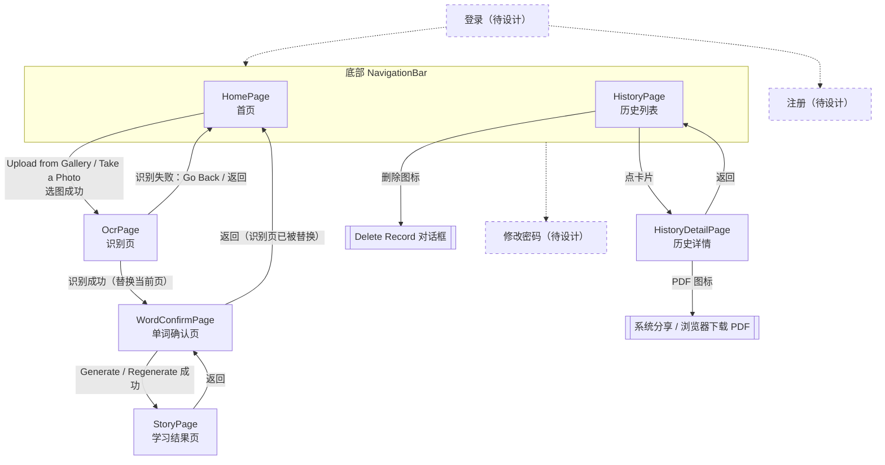

# UI 设计现状清单

> 用途：交给设计工具重新设计界面。只描述**现状**，不含改进方案。
> 依据：提交 `3d144dd`（第二阶段完成后）的 `frontend_flutter/lib/`，以及第二阶段联调时的实测数据。整理日期：2026-10-05。
> 所有中文译文都是**草稿，待确认**（界面中文化属于 U-10，尚未开始）。

---

## 1. 页面清单与流转

### 1.1 页面一览

| 页面 | 文件 | 从哪里进入 | 可以跳到哪里 |
|---|---|---|---|
| 主框架（底部 Tab） | `lib/main.dart` 中的 `MainScreen` | App 启动 | Home、History 两个 Tab |
| 首页 Home | `lib/pages/home/home_page.dart` | 底部 Tab「Home」（默认） | 选图或拍照成功后进入识别页 |
| 识别页 OcrPage | `lib/pages/ocr/ocr_page.dart` | 首页选图或拍照成功 | 识别成功：**替换**为确认页（识别页从栈中移除）；识别失败：点 Go Back 或系统返回，回到首页 |
| 单词确认页 WordConfirmPage | `lib/pages/words/word_confirm_page.dart` | 识别页识别成功 | 生成成功后进入学习结果页；返回直接回到首页 |
| 学习结果页 StoryPage | `lib/pages/story/story_page.dart` | 确认页生成成功 | 返回确认页（可以改词、换难度后点 Regenerate 重新生成） |
| 历史列表 HistoryPage | `lib/pages/history/history_page.dart` | 底部 Tab「History」 | 点卡片进入历史详情；点删除图标弹出确认对话框 |
| 历史详情 HistoryDetailPage | `lib/pages/history/history_detail_page.dart` | 历史列表点卡片 | 返回历史列表；PDF 图标打开系统分享（手机）或下载（Web） |

### 1.2 底部 Tab 结构

- 使用 Material 3 的 `NavigationBar`，共两个 Tab：

  | 序号 | 文字 | 未选中图标 | 选中图标 |
  |---|---|---|---|
  | 0 | `Home`（首页） | `Icons.home_outlined` | `Icons.home` |
  | 1 | `History`（历史） | `Icons.history_outlined` | `Icons.history` |

- **切换 Tab 时页面会被重建**（没有用 `IndexedStack`）：每次回到 History 都会重新加载第 1 页；搜索词保存在全局状态里，所以会保留。
- 识别页、确认页、学习结果页、历史详情页都是推到**根导航栈**上的全屏页面，**会盖住底部 Tab**。也就是说，进入这些页面后看不到 Tab 栏，只能用返回键回去。

### 1.3 页面流转图

虚线框是第三阶段要新增、目前还不存在的页面，见第 7 节。

---

## 2. 逐页界面元素（按从上到下的顺序）

译文列中的中文都是**草稿，待确认**。

### 2.1 首页 HomePage

| 位置 | 元素 | 原文 | 中文草稿 | 备注 |
|---|---|---|---|---|
| 顶部 | AppBar 标题（居中） | `AI English Learning` | AI 英语学习 | |
| 中部 | 图标 | — | — | `Icons.menu_book`，100px，写死 `Colors.blue` |
| | 标题文字 | `Learn English with AI` | 用 AI 学英语 | 24px，粗体，写死字号 |
| | 说明文字（两行，居中） | `Upload a photo to extract English words` `and generate learning materials` | 上传一张照片，提取英文单词 并生成学习材料 | 16px，写死 `Colors.grey` |
| | 主按钮 1（全宽，高 56） | `Upload from Gallery` | 从相册上传 | `ElevatedButton.icon`，图标 `Icons.photo_library`，圆角 12 |
| | 主按钮 2（全宽，高 56） | `Take a Photo` | 拍照 | 图标 `Icons.camera_alt` |
| 底部 | 底部 Tab | 见 1.2 | | |

整个页面内容垂直居中，四周留白 32。

### 2.2 识别页 OcrPage

| 位置 | 元素 | 原文 | 中文草稿 | 备注 |
|---|---|---|---|---|
| 顶部 | AppBar 标题 | `Recognizing Text` | 正在识别 | 左上角有系统返回箭头 |
| 中部（识别中） | 进度圈 + 文字 | `Recognizing words in your photo...` | 正在识别照片中的单词… | `PhaseIndicator`，居中 |
| 中部（失败） | 图标 | — | — | `Icons.error_outline`，64px，写死 `Colors.red` |
| | 错误文字（居中） | `Failed to recognize text: {后端 detail}` | 识别失败：{原因} | 原因文案见 3.2 |
| | 按钮 | `Go Back` | 返回 | `ElevatedButton` |
| 中部（过渡态） | 文字 | `Processing...` | 处理中… | 识别成功、跳转到确认页之前一闪而过 |

### 2.3 单词确认页 WordConfirmPage

分成上下两块：上面是可滚动的单词区，下面是固定的操作区，两块之间有一条分割线。

| 位置 | 元素 | 原文 | 中文草稿 | 备注 |
|---|---|---|---|---|
| 顶部 | AppBar 标题 | `Confirm Words` | 确认单词 | |
| 顶部（仅降级时） | 降级提示条 | 见 5.4 `DegradedBanner` | | 固定在 AppBar 下方，不随内容滚动 |
| 滚动区 | 说明文字 | `Tap a word to include or exclude it. Only the selected words are used to write the story.` | 点击单词可选中或取消。只有选中的单词会用来写短文。 | 写死 `Colors.grey[700]` |
| | 单词列表 | 识别出的单词 | — | `FilterChip`，选中时带对勾；每个 Chip 右侧都有删除 × |
| | 空状态 | `No words were recognized.` | 没有识别出单词。 | 识别结果为空时显示 |
| | 错误卡片（生成失败时） | `Failed to generate story: {原因}` + 按钮 `Retry` | 生成失败：{原因}　＋　重试 | `Card`，背景 `errorContainer`，**位于单词列表下方**，在滚动区里 |
| 分割线 | `Divider` | | | |
| 操作区 | 输入框 | 标签 `Add a word` | 添加单词 | `OutlineInputBorder`，紧凑样式；按回车等同点 Add |
| | 按钮 | `Add` | 添加 | `FilledButton.tonal`，在输入框右侧 |
| | 难度选择 | `Difficulty` + `Beginner` / `Intermediate` / `Advanced` | 难度　＋　初级 / 中级 / 高级 | 三个 `ChoiceChip`，默认选中 `Intermediate` |
| | 主按钮（全宽） | `Generate`；已生成过时显示 `Regenerate` | 生成；重新生成 | `FilledButton`，生成中会变成进度圈加文字，见 3.3 |
| 浮层 | SnackBar：输入为空 | `Enter a word first` | 请先输入单词 | |
| | SnackBar：没有字母 | `A word must contain at least one letter` | 单词至少要包含一个字母 | |
| | SnackBar：重复 | `That word is already in the list` | 这个单词已经在列表里了 | |

### 2.4 学习结果页 StoryPage

| 位置 | 元素 | 原文 | 中文草稿 | 备注 |
|---|---|---|---|---|
| 顶部 | AppBar 标题 | `Learning Result` | 学习结果 | |
| 顶部右侧 | 保存按钮 | tooltip：`Save Record` / `Saving` / `Saved` | 保存记录 / 保存中 / 已保存 | `SaveButton`，见 5.2 |
| 顶部（仅降级时） | 降级提示条 | 见 5.4 | | 固定在 AppBar 下方 |
| 滚动区 | 分节卡片 1 | 标题 `Recognized Words` | 识别的单词 | 内容是 `Chip` 列表，文字写死 `Colors.black87` |
| | 分节卡片 2 | 标题 `English Story` | 英文短文 | 目标单词加粗，使用主题主色 |
| | 分节卡片 3 | 标题 `Chinese Translation` | 中文翻译 | 中译中的 `苹果 (apple)` 这类夹注加粗，使用主题主色 |
| | 分节卡片 4 | 标题 `English Fill-in-the-Blank` | 英文填空 | 纯文本，空格用 `___` 表示 |
| | 分节卡片 5 | 标题 `Chinese Fill-in-the-Blank` | 中文填空 | 纯文本，形如 `___ (___)` |
| 空数据 | 文字 | `No data` | 暂无数据 | 当前没有生成结果时显示，正常流程到不了这里 |
| 浮层 | SnackBar：保存成功 | `Record saved` | 已保存 | |
| | SnackBar：保存失败 | `Failed to save record: {原因}`（兜底：`Failed to save record`） | 保存失败：{原因} | |

分节卡片之间间距 16，页面四周留白 16。

### 2.5 历史列表 HistoryPage

| 位置 | 元素 | 原文 | 中文草稿 | 备注 |
|---|---|---|---|---|
| 顶部 | AppBar 标题 | `History` | 历史记录 | 没有返回箭头（Tab 页） |
| 顶部 | 搜索框 | 提示文字 `Search words or English story` | 搜索单词或英文短文 | 左侧 `Icons.search`；有内容时右侧出现 `Icons.clear`（tooltip `Clear search` / 清空搜索）。只能搜英文，见 4.5 |
| 顶部（出错时） | 错误条 | `Failed to load records: {原因}` / `Failed to load more records: {原因}` / `Failed to delete record: {原因}` | 加载记录失败 / 加载更多失败 / 删除记录失败：{原因} | 全宽，背景 `errorContainer` |
| 列表 | 记录卡片（重复） | 见下方「卡片结构」 | | |
| 列表底部 | 加载更多 | `Load more ({已加载} of {总数})` | 加载更多（{已加载} / {总数}） | `OutlinedButton`，居中 |
| | 已全部加载 | `Showing all {N} records` | 已显示全部 {N} 条记录 | 灰色文字，使用 `colorScheme.outline` |
| 空状态 | 无记录 | 图标 + `No records yet` | 还没有记录 | `Icons.history`，64px，写死 `Colors.grey` |
| | 搜索无结果 | 图标 + `No records match "{关键词}"` + 按钮 `Clear search` | 没有匹配 "{关键词}" 的记录　＋　清空搜索 | `Icons.search_off`，64px，写死 `Colors.grey` |
| 对话框 | 标题 | `Delete Record` | 删除记录 | |
| | 内容 | `Are you sure you want to delete this record ({单词1, 单词2, …})?` | 确定要删除这条记录（{单词…}）吗？ | 把**全部单词**都拼进这一句 |
| | 按钮 | `Cancel` / `Delete` | 取消 / 删除 | `Delete` 写死红色 |

**卡片结构**（`_RecordCard`，圆角 12，卡片之间间距 12）：

1. 第一行：创建时间（灰色 12px，**直接显示后端的 ISO 字符串**，例如 `2026-10-05T13:28:31.384123`）；右侧是删除图标 `Icons.delete_outline`（20px，写死红色，tooltip `Delete` / 删除）。
2. 英文短文：最多 3 行，超出省略。
3. 单词 Chip：**显示全部单词**，不截断，12px，紧凑样式。

点卡片的任何位置都会进入历史详情页。

### 2.6 历史详情 HistoryDetailPage

| 位置 | 元素 | 原文 | 中文草稿 | 备注 |
|---|---|---|---|---|
| 顶部 | AppBar 标题 | `Learning Record` | 学习记录 | |
| 顶部右侧 | PDF 按钮 | tooltip `Export PDF` | 导出 PDF | `Icons.picture_as_pdf` |
| 滚动区 | 创建时间 | ISO 字符串 | — | 灰色 12px，写死颜色 |
| | 5 个分节卡片 | 和学习结果页相同：`Recognized Words`、`English Story`、`Chinese Translation`、`English Fill-in-the-Blank`、`Chinese Fill-in-the-Blank` | 同 2.4 | **两个填空卡片的文字样式有错误**，见第 10 节第 1 条 |
| 浮层 | SnackBar：导出失败 | `Failed to export PDF: {原始异常}` | 导出 PDF 失败：{原因} | 直接显示原始异常文本，长度不定 |

历史详情页不显示降级提示条（数据库里没有存这个标记），也没有保存按钮。

---

## 3. 每个页面的所有状态

### 3.1 首页
| 状态 | 显示 |
|---|---|
| 正常 | 2.1 中的全部元素 |
| 取消选图 | 没有任何变化，停在首页 |
| 选图中 | 由系统相册或相机接管，App 内没有加载状态 |

### 3.2 识别页
| 状态 | 显示 |
|---|---|
| 识别中 | 居中的进度圈 + `Recognizing words in your photo...` |
| 识别成功 | 闪过 `Processing...` 后，直接替换为确认页 |
| 识别失败 | 红色 `error_outline` 图标 + 错误文字 + `Go Back` 按钮。常见原因： `OCR service is unavailable. Please try again later.`（OCR 不可用） `Cannot reach the server. Please check your connection.`（连不上服务器） `The request timed out. Please try again.`（超时） `Only image files are allowed`（不是图片） |

### 3.3 单词确认页
| 状态 | 显示 |
|---|---|
| 正常 | 单词 Chip（默认全部选中）、添加单词、难度、`Generate` |
| 识别结果为空 | `No words were recognized.`；没有选中的单词，所以 `Generate` 禁用；仍然可以手动添加 |
| 一个都没选 | `Generate` 禁用（灰色） |
| 生成中 | 主按钮禁用，按钮内变成"小进度圈 + `Writing your story and exercises...`"；三个难度 Chip 禁用。**单词 Chip、输入框、Add 按钮仍然可以操作**（见第 10 节） |
| 生成失败 | 单词列表下方出现红色错误卡片 + `Retry`；主按钮恢复可点。常见原因： `AI service is unavailable. Please try again later.` `AI service timed out. Please try again.` `AI service returned an error. Please try again later.` `AI returned an invalid response. Please try again.` `AI service is not configured.` |
| 已生成过（从结果页返回） | 主按钮文字变为 `Regenerate` |
| OCR 降级（仅开发环境） | 顶部出现浅色提示条，见 5.4 |
| 添加单词校验失败 | 底部 SnackBar，三种文案见 2.3 |

### 3.4 学习结果页
| 状态 | 显示 |
|---|---|
| 正常 | 5 个分节卡片；右上角是保存图标 `Icons.save` |
| 保存中 | 右上角变成小进度圈，不可点 |
| 已保存 | 右上角变成 `Icons.check`，置灰，不可再点 |
| 保存失败 | SnackBar 显示错误；按钮恢复为可保存 |
| 重新生成后 | 保存状态复位为"可保存" |
| AI 降级（仅开发环境） | 顶部提示条，见 5.4 |
| 无数据 | 居中显示 `No data` |

### 3.5 历史列表
| 状态 | 显示 |
|---|---|
| 首次加载中 | 搜索框下方居中显示进度圈 |
| 正常 | 卡片列表 + 底部 `Load more (x of y)` 或 `Showing all N records` |
| 加载更多中 | 列表底部变成小进度圈 |
| 无记录 | `Icons.history` + `No records yet` |
| 搜索无结果 | `Icons.search_off` + `No records match "…"` + `Clear search` |
| 加载失败 | 顶部红色错误条；**下方仍然显示 `No records yet`**（见第 10 节） |
| 删除确认 | 对话框，见 2.5 |
| 删除失败 | 顶部红色错误条，列表不变 |

### 3.6 历史详情
| 状态 | 显示 |
|---|---|
| 正常 | 创建时间 + 5 个分节卡片 |
| 导出中 | 没有任何加载提示 |
| 导出失败 | SnackBar：`Failed to export PDF: {原始异常}` |

---

## 4. 真实内容的长度范围（设计时预留空间用）

依据：代码中的限制，以及第二阶段联调时的后端日志。凡是标"估计"的，都没有精确统计过。

| 内容 | 范围 | 依据与说明 |
|---|---|---|
| 识别出的单词数量 | **没有上限**。联调中实测 18、21、43 个；mock 词表为 3–15 个 | 前后端都不限制数量。确认页、结果页、历史卡片、PDF 都会显示全部单词 |
| 单个"单词"的长度 | **没有上限**。通常是 3–12 个字母，但 OCR 可能把整行识别成一项（实测出现过 `apple river brave`、`"appleriverbrave`） | 手动添加只要求至少含一个字母，没有长度限制 |
| 英文短文 | 3 个词、beginner：约 30 个英文词；15 个词：约 110–150 个英文词；43 个词：约 170 个英文词，分 3 段（段落之间是空行） | 模型输出上限 2000 tokens |
| 中文翻译 | 估计约为英文词数的 1.5–2.5 倍汉字，即大约 50–400 个汉字；每个目标词后面带 ` (english)` 夹注 | |
| 英文填空 / 中文填空 | 和对应的短文、译文等长；空格用 `___`，中文填空形如 `___ (___)` | |
| 历史列表每项 | 创建时间（ISO 字符串，约 26 个字符）+ 英文短文前 3 行 + **全部单词 Chip** | 单词多的记录，卡片会非常高 |
| 历史列表每页 | 20 条 | 底部有加载更多 |
| 最长的错误文案 | `Failed to load more records: Cannot reach the server. Please check your connection.`（83 个字符） | 不算导出 PDF 失败的原始异常，那一条长度不定 |
| 最长的提示条文案 | `AI service is not configured. This is a sample story, not one written from your words.`（86 个字符），下面还有一行 `Reason: …` | |
| 最长的说明文字 | 确认页说明：89 个字符 | |
| 删除确认对话框 | 会把全部单词拼进一句话，43 个词时会非常长 | |

---

## 5. 共用组件（`lib/widgets/`）

| 组件 | 文件 | 用途 | 出现的页面 | 状态 |
|---|---|---|---|---|
| `HighlightedText` | `highlighted_text.dart` | 渲染短文，把目标单词加粗并用主色标出。`.english` 按词边界匹配；`.chinese` 匹配 `苹果 (apple)` 这种夹注 | 学习结果页、历史详情 | 无状态；正文颜色写死 `Colors.black87` |
| `SaveButton` | `save_button.dart` | AppBar 上的保存图标按钮 | 学习结果页 | 可保存（`Icons.save`）/ 保存中（18px 进度圈，禁用）/ 已保存（`Icons.check`，禁用） |
| `SectionCard` | `section_card.dart` | 带标题的分节卡片 | 学习结果页、历史详情 | 无状态；标题 16px 粗体，写死 `Colors.blue`；卡片 `elevation 2`、圆角 12、内边距 16 |
| `DegradedBanner` | `degraded_banner.dart` | 降级提示条：服务不可用、返回示例数据时显示（只会出现在开发环境） | 确认页（OCR 降级）、学习结果页（AI 降级） | 按原因显示不同文案，见下表；配色 `tertiaryContainer`，图标 `Icons.info_outline`，不可关闭 |
| `PhaseIndicator` | `phase_indicator.dart` | 识别中 / 生成中的等待提示 | 识别页（大号，居中）、确认页主按钮内（紧凑） | 识别中 / 生成中 / 空闲（不显示）；紧凑模式下是 18px 进度圈 + 一行文字 |
| `DifficultySelector` | `difficulty_selector.dart` | 难度选择 | 确认页 | 三选一；生成中整体禁用 |
| `HistoryListFooter` | `history_list_parts.dart` | 历史列表底部 | 历史列表 | 还有更多（`Load more (x of y)`）/ 加载中（24px 进度圈）/ 已全部加载（`Showing all N records`） |
| `HistoryEmptyState` | `history_list_parts.dart` | 历史列表的空状态 | 历史列表 | 无记录 / 搜索无结果（带 `Clear search`） |

**页面内的私有组件**（不在 `lib/widgets/` 下，但设计时同样要考虑）：

- `_UploadButton`（首页）：全宽、高 56、圆角 12 的图标按钮。
- `_ErrorBanner`（确认页）：`errorContainer` 背景的卡片，错误文字 + `Retry`。
- `_RecordCard`（历史列表）：见 2.5 的卡片结构。
- `_HistoryErrorText`（历史列表）：全宽的 `errorContainer` 文字条。

### 5.4 `DegradedBanner` 的文案

| reason | 原文 | 中文草稿 |
|---|---|---|
| `ocr_unavailable` | `OCR service unavailable. These are sample words, not words from your photo.` | OCR 服务不可用。以下是示例单词，不是从你的照片中识别的。 |
| `ocr_mock` | `OCR is in mock mode. These are sample words, not words from your photo.` | OCR 处于模拟模式。以下是示例单词，不是从你的照片中识别的。 |
| `ai_not_configured` | `AI service is not configured. This is a sample story, not one written from your words.` | AI 服务未配置。这是一篇示例短文，不是根据你的单词写的。 |
| 其他 `ai_*` | `AI service unavailable. This is a sample story, not one written from your words.` | AI 服务不可用。这是一篇示例短文，不是根据你的单词写的。 |
| 其他 | `Some results are sample data, not generated from your input.` | 部分结果是示例数据，不是根据你的输入生成的。 |
| 第二行（所有情况） | `Reason: {reason}` | 原因：{reason} |

---

## 6. 当前主题

| 项 | 现状 |
|---|---|
| ThemeData | `lib/main.dart`：`ThemeData(colorSchemeSeed: Colors.blue, useMaterial3: true)`，**这是唯一的主题配置** |
| 颜色来源 | 由 `Colors.blue` 作为种子，自动生成 Material 3 的 `ColorScheme`（浅色） |
| 深色模式 | **没有**（没有 `darkTheme`，也没有 `themeMode`） |
| 字体 | 没有设置 `fontFamily`，使用平台默认字体（Android / Web 为 Roboto；中文由系统回退字体显示）。`assets/fonts/NotoSansSC-Regular.ttf` **只在 PDF 导出时使用** |
| 字号层级 | 没有自定义 `textTheme`。旧页面大多直接写死字号；第二阶段新增的组件使用了 `textTheme`（`labelLarge`、`bodyMedium`、`bodySmall`） |
| 圆角 | 卡片和首页按钮写死 12；其余使用 Material 3 默认值 |

**写死的颜色**（不跟随主题，换主题或做深色模式时都要处理）：

| 颜色 | 位置 |
|---|---|
| `Colors.blue` | 种子色（`main.dart`）；首页大图标；`SectionCard` 的标题 |
| `Colors.black87` | `HighlightedText` 正文；学习结果页和历史详情页的单词 Chip 文字、两个填空卡片的文字 |
| `Colors.grey` / `Colors.grey[700]` | 首页说明文字；确认页说明文字；历史卡片和详情页的时间；空状态图标 |
| `Colors.red` | 识别页错误图标；历史卡片删除图标；删除对话框的 `Delete` 按钮 |

**使用主题色的地方**：`colorScheme.primary`（单词高亮）、`errorContainer` / `onErrorContainer`（错误卡片和错误条）、`tertiaryContainer` / `onTertiaryContainer`（降级提示条）、`outline`（`Showing all N records`）。

**写死的字号**：24（首页标题）、16（首页说明、首页按钮、`SectionCard` 标题）、12（历史卡片的时间和 Chip、详情页的时间）。

**写死的尺寸**：首页图标 100、首页按钮高 56、空状态与错误图标 64、删除图标 20、进度圈 18 / 24、页面内边距 16 或 32、卡片圆角 12。

---

## 7. 第三阶段将新增的页面（待设计）

> **依据说明**：当前的 `CLAUDE.md` 仍是第二阶段版本，第 6 节和第 9 节**没有** A-2 / S-2 的具体要求。`docs/问题清单与改进建议.md` 对 A-2 给出的"最小可行方案"是设备 UUID，"正式方案再上账号体系"。
> 下面这些页面按本次整理的要求（登录、注册、修改密码、登出，以及"忘记密码请联系管理员"）起草。**字段规则、校验文案、入口位置都是草稿，待确认**，需要在第三阶段的 CLAUDE.md 中定稿。

### 7.1 登录页（待设计）

| 元素 | 原文草稿 | 中文草稿 | 说明 |
|---|---|---|---|
| 标题 | `Log in` | 登录 | |
| 输入框 | `Username` | 用户名 | |
| 输入框 | `Password` | 密码 | 遮挡显示，建议带"显示 / 隐藏"切换 |
| 主按钮 | `Log in` | 登录 | 提交中禁用，显示进度 |
| 链接 | `Don't have an account? Sign up` | 还没有账号？注册 | 跳到注册页 |
| 提示文字 | `Forgot your password? Please contact the administrator.` | 忘记密码？请联系管理员。 | 只是一行提示，不是"找回密码"流程 |
| 错误：用户名或密码错误 | `Incorrect username or password.` | 用户名或密码错误。 | 为了安全，不区分是哪一项错 |
| 错误：必填项为空 | `Enter your username and password.` | 请输入用户名和密码。 | |
| 错误：网络 | 复用 `Cannot reach the server. Please check your connection.` | 无法连接服务器，请检查网络。 | |
| 状态：登录已过期 | `Your session has expired. Please log in again.` | 登录已过期，请重新登录。 | 从任何页面被踢回登录页时显示 |

### 7.2 注册页（待设计）

| 元素 | 原文草稿 | 中文草稿 | 说明 |
|---|---|---|---|
| 标题 | `Sign up` | 注册 | |
| 输入框 | `Username` | 用户名 | 规则待定，例如 3–20 位字母、数字、下划线 |
| 输入框 | `Password` | 密码 | 规则待定，例如至少 8 位 |
| 输入框 | `Confirm password` | 确认密码 | |
| 主按钮 | `Sign up` | 注册 | |
| 链接 | `Already have an account? Log in` | 已有账号？登录 | |
| 错误：用户名已存在 | `This username is already taken.` | 该用户名已被使用。 | |
| 错误：用户名格式 | `Username must be 3–20 letters, numbers, or underscores.` | 用户名须为 3–20 位字母、数字或下划线。 | 数值待定 |
| 错误：密码太短 | `Password must be at least 8 characters.` | 密码至少 8 位。 | 数值待定 |
| 错误：两次密码不一致 | `Passwords do not match.` | 两次输入的密码不一致。 | |

### 7.3 修改密码页（待设计）

| 元素 | 原文草稿 | 中文草稿 |
|---|---|---|
| 标题 | `Change password` | 修改密码 |
| 输入框 | `Current password` | 当前密码 |
| 输入框 | `New password` | 新密码 |
| 输入框 | `Confirm new password` | 确认新密码 |
| 主按钮 | `Save` | 保存 |
| 成功提示 | `Password changed.` | 密码已修改。 |
| 错误：当前密码错误 | `Current password is incorrect.` | 当前密码不正确。 |
| 错误：新密码太短 | `Password must be at least 8 characters.` | 密码至少 8 位。 |
| 错误：两次不一致 | `Passwords do not match.` | 两次输入的密码不一致。 |
| 错误：与旧密码相同（可选） | `New password must be different from the current one.` | 新密码不能与当前密码相同。 |

### 7.4 登出入口（待设计）

- 现在 App 里**没有任何"账户"或"设置"入口**，需要设计一个位置来放"当前用户名、修改密码、登出"。可选：首页 AppBar 右侧的账户图标、新增第三个 Tab，或者放进一个设置页。
- 登出前的确认对话框草稿：`Log out?` / 确定要登出吗？，按钮 `Cancel` / `Log out`（取消 / 登出）。

### 7.5 加入账号后，现有页面会受到的影响（供设计时考虑）

- App 启动时要先判断是否已登录，没有登录就显示登录页，所以流转图要多一个入口。
- 历史记录会按用户隔离，"No records yet"会成为新用户的首屏状态。
- 任何请求都可能因为登录过期而失败，需要一个统一的"被踢回登录页"的处理。

---

## 8. PDF 导出版式

- **入口**：只有历史详情页右上角的 `Icons.picture_as_pdf`。学习结果页**不能**导出。
- **方式**：`Printing.sharePdf`。手机上会打开系统分享面板，Web 上会下载文件。文件名 `english_learning_{记录 id}.pdf`。
- **纸张**：A4，四周页边距 32，内容超过一页时自动分页（`MultiPage`）。
- **字体**：整份文档使用 `NotoSansSC-Regular`（支持中文）。

**从上到下的结构：**

| 区块 | 内容 | 样式 |
|---|---|---|
| 页眉标题 | `English Learning Record` | 22，粗体，`Header` level 0（带下划线） |
| 日期 | `Date: {createdAt}` | 11，`grey700`；直接是 ISO 字符串 |
| 分节：`Recognized Words` | 单词胶囊，`blue50` 底色，圆角 12，字号 10 | 分节标题 14，粗体，`blue700` |
| 分节：`English Story` | 段落 | 12，行距 1.5 |
| 分节：`Chinese Translation` | 段落 | 12，行距 1.5 |
| 分节：`English Fill-in-the-Blank` | 段落 | 12，行距 1.5，`blue800` |
| 分节：`Chinese Fill-in-the-Blank` | 段落 | 12，行距 1.5，`blue800` |

**PDF 里没有的东西**：目标单词高亮、填空的答案、页码、页脚、难度信息。

---

## 9. 目标平台

| 平台 | 现状 | 依据 |
|---|---|---|
| Web | **目前实际在用**。第二阶段所有联调都是 `flutter run` 到 Chrome 桌面浏览器，截图宽度约 2000px。另外，`backend_fastapi/static/` 里还有一份 2026 年 6 月的旧网页构建，由后端提供 | 后端访问日志里每个请求前面都有 `OPTIONS` 跨域预检；用户提供的截图 |
| Android | **用过，但第二阶段没有用**。`build/app/outputs/flutter-apk/app-release.apk` 构建于 2026-06-02；`AndroidManifest.xml` 开启了明文 HTTP；`api_config.dart` 注释里写了模拟器地址 `10.0.2.2` | 构建产物、配置 |
| iOS | **没有证据表明用过**。工程存在，但 `Info.plist` 里**没有** `NSCameraUsageDescription` 和 `NSPhotoLibraryUsageDescription`，相机和相册在 iOS 上会直接崩溃 | `ios/Runner/Info.plist` |

**屏幕尺寸**：
- 界面按**手机竖屏**设计：单列布局、全宽按钮、Web manifest 声明了 `portrait-primary`。
- 但实际主要在**桌面浏览器的宽窗口**中使用，而代码**没有任何最大宽度限制和响应式布局**，所有内容会被拉满整个窗口宽度（见第 10 节）。
- **主要的目标设备需要你确认**：是手机 App、手机浏览器，还是桌面浏览器。

**App 名称在各处不一致**：

| 位置 | 名称 |
|---|---|
| `MaterialApp.title` 和首页标题 | `AI English Learning` |
| Web `<title>` 和 manifest | `english_learning_app` |
| Android 桌面名称 | `english_learning_app` |
| iOS 桌面名称 | `English Learning App` |
| PDF 标题 | `English Learning Record` |

---

## 10. 整理时发现的界面问题（只记录，没改）

1. **历史详情页两个填空卡片的样式错误**：显示为 48 号字、黄色双下划线（调试模式的错误样式）。原因是用了 `Scaffold` 外层的 `context` 取文字样式。（第二阶段已记录）
2. **时间直接显示 ISO 字符串**：历史卡片、详情页、PDF 都是 `2026-10-05T13:28:31.384123` 这种格式，没有格式化。
3. **没有最大宽度限制**：在桌面浏览器上，所有页面都被拉满窗口宽度，正文一行很长，首页按钮会横跨整个屏幕。
4. **历史卡片显示全部单词**：43 个词的记录，卡片会非常高。
5. **删除对话框把全部单词拼进一句话**：单词多时，对话框文字很长。
6. **确认页的错误卡片在单词列表下方**：单词多时，它在滚动区的底部，用户点完底部的 `Generate` 后可能看不到错误。
7. **生成中单词仍然可以改**：生成期间，单词 Chip、输入框、Add 按钮都还能操作，但改动不会影响正在进行的那次生成，容易让人误以为改了会生效。
8. **新照片进入确认页时，按钮显示 `Regenerate`**：上一轮的结果没有清掉（`clearCurrentRecord()` 没有调用方）。（第二阶段已记录）
9. **历史页加载失败时，错误条下面仍显示 `No records yet`**，会让人误以为真的没有记录。（第二阶段已记录）
10. **导出 PDF 失败时显示原始异常文本**：`Failed to export PDF: $e`，和其他地方"优先显示后端 detail、原始异常只写日志"的做法不一致。导出时也没有任何加载提示。
11. **只能从历史详情导出 PDF**：刚生成的学习结果页不能直接导出，必须先保存、再去历史页找。
12. **填空没有答案查看方式**：屏幕和 PDF 上都只有 `___`，看不到答案；也没有交互式作答。
13. **写死的颜色会妨碍深色模式**：`Colors.black87` 的正文在深色背景上几乎看不见；`SectionCard` 标题的蓝色不跟随主题。
14. **在桌面 Web 上，`Take a Photo` 和 `Upload from Gallery` 的效果基本一样**：都是打开文件选择框。
15. **App 名称在 6 处不一致**，见第 9 节。
16. **iOS 缺少相机和相册的权限说明**，在 iOS 上使用会崩溃。
17. **界面英文、内容中英混合**，目标用户是中国学生。中文化属于 U-10。
18. **识别页成功后会闪一下 `Processing...`**，只是过渡状态，没有实际意义。
19. **学习结果页没有"回到首页"的入口**：要连按两次返回（结果页 → 确认页 → 首页）。
20. **降级提示条显示内部原因代码**（`Reason: ai_unavailable`）。目前只会出现在开发环境，如果以后要给最终用户看，需要换掉。
