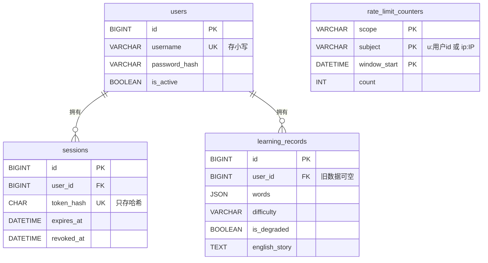

# 数据库设计方案（MySQL）

> 版本：2026-10-07。放在仓库 `docs/数据库设计方案.md`，第三阶段 D-1、A-2、S-5 以本文为准。
> 标「待确认」的地方以 CLAUDE.md 第 9 节的决定为准；本文与 CLAUDE.md 冲突时，以 CLAUDE.md 为准。

## 1. 背景与设计目标

建议用 4 张表支撑第三阶段：用户、登录会话、学习记录、限流计数。现在的 SQLite 只有一张 `learning_records` 表，没有用户概念，所有人共用同一份数据。

这套设计要支撑的功能：

- 用户名 + 密码注册、登录、登出、修改密码
- 学习记录按用户隔离，A 看不到 B 的任何记录
- 按用户和 IP 限制识别、生成、登录、注册的次数
- 历史记录的分页、关键字搜索、收藏、笔记（现有功能保留）

设计原则：

- **只建当前功能需要的表。** 生词本、学习统计等未来功能列在第 9 节，不预先建表。
- **安全优先。** 密码和登录凭证只存哈希；数据隔离在数据库层面有索引和外键支撑。
- **结构变更可追溯。** 所有建表、改表都通过 Alembic 迁移执行，不手写一次性 SQL。

## 2. 技术选型

**MySQL 8.4 LTS（Docker）+ `utf8mb4` + SQLAlchemy 2.0 异步 + Alembic。**

| 项 | 选择 | 理由 |
| --- | --- | --- |
| 版本 | MySQL 8.4 LTS，运行在 Docker 中 | MySQL 8.0 已于 2026 年 4 月停止支持；8.4 是当前长期支持版，支持到 2032 年 4 月（[来源](https://www.xictron.com/en/blog/mysql-8-0-end-of-life-shop-database-migration-2026/)）。不用 9.x 创新版 |
| 字符集 | `utf8mb4`，排序规则 `utf8mb4_0900_ai_ci` | 中文翻译和部分特殊字符必须用 `utf8mb4`；MySQL 的 `utf8` 只有 3 字节 |
| 存储引擎 | InnoDB | 支持事务和外键，8.4 默认值 |
| 访问方式 | SQLAlchemy 2.0（异步模式） | 后端全异步（FastAPI + httpx），数据库访问也用异步，避免阻塞 |
| 驱动 | `aiomysql` 或 `asyncmy` | 两者都是 SQLAlchemy 支持的异步 MySQL 驱动。实现前核实当前维护状态再选定 |
| 迁移工具 | Alembic | 每次建表、改表生成版本化迁移脚本，可升级、可回退，开发、测试、生产结构一致 |
| 认证方式 | `caching_sha2_password` | 8.4 默认禁用旧的 `mysql_native_password`。驱动使用该方式时可能需要 `cryptography` 包 |

**为什么不选同步方案（PyMySQL + 普通函数）：** 识别、生成接口都是 `async`，鉴权和限流又要在这些接口里查库。同步查库会阻塞事件循环，要绕开就得把调用改进线程池，反而更乱。

**换库后原 A-4（SQLite 阻塞）取消**；`aiosqlite`、`aiofiles` 两个未使用的依赖删除。

## 3. ER 关系图

`users` 是核心，`sessions` 和 `learning_records` 通过外键挂在用户下面，外键均为级联删除。`rate_limit_counters` 按文本里的用户 id 或 IP 计数，不设外键；它只在限流选数据库存储时才建，`sessions` 也取决于凭证方案（见第 9 节）。

## 4. 逐表设计

主键统一 `BIGINT UNSIGNED AUTO_INCREMENT`；时间统一 `DATETIME(3)`，存 UTC（毫秒精度）。标「新增」的字段是现有 SQLite 表里没有的。

### 4.1 users（用户）

| 字段 | 类型 | 约束 | 说明 |
| --- | --- | --- | --- |
| id | BIGINT UNSIGNED | 主键，自增 | |
| username | VARCHAR(20) | 非空，唯一 | 统一存小写；规则 3~20 位字母、数字、下划线（待确认） |
| password_hash | VARCHAR(255) | 非空 | 密码哈希库（argon2 或 bcrypt）的输出，含盐和参数；绝不存明文 |
| is_active | BOOLEAN | 非空，默认 TRUE | 管理员可停用滥用的账号，停用后无法登录 |
| password_changed_at | DATETIME(3) | 可空 | 改密码时更新，用于让旧凭证失效 |
| last_login_at | DATETIME(3) | 可空 | 最近一次登录时间 |
| created_at | DATETIME(3) | 非空，默认当前时间 | |
| updated_at | DATETIME(3) | 非空，更新时自动刷新 | |

索引：`uk_users_username (username)`。

### 4.2 sessions（登录会话）

前提：登录凭证采用「服务端会话」方案（待确认）。若改用 JWT，这张表不需要。

| 字段 | 类型 | 约束 | 说明 |
| --- | --- | --- | --- |
| id | BIGINT UNSIGNED | 主键，自增 | |
| user_id | BIGINT UNSIGNED | 非空，外键 → users.id，级联删除 | |
| token_hash | CHAR(64) | 非空，唯一 | 凭证的 SHA-256 十六进制值；凭证原文只发给客户端，数据库不存 |
| created_at | DATETIME(3) | 非空 | |
| expires_at | DATETIME(3) | 非空 | 建议创建后 30 天（待确认） |
| revoked_at | DATETIME(3) | 可空 | 登出、改密码时填上，凭证立即失效 |
| last_used_at | DATETIME(3) | 可空 | 可选；每次请求都更新会增加写入，可改为每小时最多更新一次 |

索引：`uk_sessions_token_hash (token_hash)`、`idx_sessions_user (user_id)`、`idx_sessions_expires (expires_at)`。

凭证是 32 字节随机数，熵足够高，用 SHA-256 存哈希即可，不需要密码那样的慢哈希。

### 4.3 learning_records（学习记录）

| 字段 | 类型 | 约束 | 说明 |
| --- | --- | --- | --- |
| id | BIGINT UNSIGNED | 主键，自增 | |
| user_id | BIGINT UNSIGNED | 可空，外键 → users.id，级联删除 | **新增。** 只有迁移过来的旧记录为空；新记录必须有值 |
| words | JSON | 非空 | 单词数组，如 `["apple", "library"]`；SQLite 里是 JSON 字符串 |
| difficulty | VARCHAR(16) | 非空，CHECK 限定三个值 | **新增（待确认）。** beginner / intermediate / advanced；旧记录统一填 intermediate |
| english_story | TEXT | 非空 | |
| chinese_translation | TEXT | 非空 | |
| english_blank | TEXT | 非空 | |
| chinese_blank | TEXT | 非空 | |
| is_favorite | BOOLEAN | 非空，默认 FALSE | |
| notes | TEXT | 可空 | |
| is_degraded | BOOLEAN | 非空，默认 FALSE | **新增（待确认）。** 标记记录是否由降级的示例数据生成 |
| image_name | VARCHAR(255) | 可空 | 原 `image_url`，实际只存文件名，改名避免误解（待确认） |
| created_at | DATETIME(3) | 非空 | |
| updated_at | DATETIME(3) | 非空，更新时自动刷新 | |

索引：`idx_records_user_created (user_id, created_at, id)` 支撑按用户分页、按时间倒序；`idx_records_user_fav (user_id, is_favorite)` 支撑收藏筛选。

### 4.4 rate_limit_counters（限流计数）

前提：限流计数存数据库（待确认）。若选进程内存，这张表不需要。

| 字段 | 类型 | 约束 | 说明 |
| --- | --- | --- | --- |
| scope | VARCHAR(32) | 联合主键 | 限流的动作：ocr、compose、login、register |
| subject | VARCHAR(64) | 联合主键 | 被限的对象：`u:<用户id>` 或 `ip:<IP>`（IPv6 最长 45 字符） |
| window_start | DATETIME | 联合主键 | 时间窗口起点，如当天 00:00（UTC）或某个 10 分钟整点 |
| count | INT UNSIGNED | 非空，默认 0 | 窗口内已用次数 |

主键 `(scope, subject, window_start)`；索引 `idx_rl_window (window_start)` 用于清理。

计数用 `INSERT … ON DUPLICATE KEY UPDATE count = count + 1` 一条语句完成，并发下不会少算。不要用已废弃的 `VALUES()` 写法。IP 属于个人信息，过期窗口的数据保留不超过 2 天。

## 5. 关键设计决策与取舍

| 决策 | 选择 | 另一种做法 | 理由 |
| --- | --- | --- | --- |
| 单词怎么存 | 记录里一个 JSON 字段 | 单独建 `record_words` 表 | 现有功能只需整组单词跟着记录走和关键字搜索。生词本、学习统计需要时再拆表 |
| 删除方式 | 记录硬删除；删用户时级联删除会话和记录 | 软删除（`deleted_at`） | 软删除要求每个查询多加条件，漏一处就泄露已删数据；用户删掉的数据本不该留存 |
| 时间与时区 | 一律存 UTC，前端显示时转本地时间 | 存北京时间 | 服务器、容器时区可能不一致 |
| 主键 | 自增整数 | UUID | 每个查询都带 `user_id`、越权返回 404，猜到 ID 也读不到；自增在 InnoDB 中效率更高 |
| 用户名大小写 | 存小写，注册和登录时先转小写 | 依赖排序规则 | 显式转换更直观 |
| 枚举值 | VARCHAR + CHECK | MySQL ENUM | ENUM 增减取值要改表结构 |
| 搜索 | `LIKE '%关键字%'`，查询都带 `user_id`，转义 `%` 和 `_` | 全文索引（中文分词） | 每个用户记录量很小，按 `user_id` 缩小范围后逐条匹配足够 |
| 分页 | OFFSET 分页，`page_size` 设上限 | 按 id 游标分页 | 改游标要改前端翻页逻辑，本阶段不做 |

两点 MySQL 特性：

- `TEXT` 和 `JSON` 字段不能直接建普通索引，搜索只能逐条匹配，所以一定先用 `user_id` 缩小范围。
- 默认排序规则不区分大小写，`LIKE 'Apple'` 也会匹配 `apple`，对搜索是好事。

## 6. 数据迁移

SQLite 里现有的学习记录应该都是开发和测试数据，两种处理方式（待确认）：

| 方式 | 做法 | 适合 |
| --- | --- | --- |
| A. 不迁移 | MySQL 从空库开始；SQLite 文件备份后保留，不删除 | 旧记录都是测试数据 |
| B. 迁移并指派 | 一次性脚本：读 SQLite → 转换字段 → 写入 MySQL，`user_id` 留空；再用另一个脚本指派给指定账号 | 旧记录里有想保留的内容 |

选 B 时的字段转换：

- `words`：JSON 字符串解析成数组；解析失败的记录单独列出，不中断迁移
- `image_url` → `image_name`，原样复制
- `difficulty` 统一填 `intermediate`，`is_degraded` 统一填 FALSE
- 时间：先核实 SQLite 中存的是什么时区，统一换算为 UTC

无论选哪种，**迁移前先备份 SQLite 文件**；选 B 时迁移后核对两边记录数。迁移完成并确认无误后，后端不再读 SQLite，相关代码与路径配置一并移除。

## 7. 环境与运维

| 环境 | 数据库 | 说明 |
| --- | --- | --- |
| 本地开发 | Docker 中的 MySQL 8.4，库名 `english_learning` | 加进 `docker-compose.yml`，数据挂命名卷；**主机端口 3307**（本机已装的 MySQL 8.0 占用 3306，保留不动），只绑定 `127.0.0.1` |
| 自动化测试 | 同一容器中的独立库 `english_learning_test` | 每轮测试前由 Alembic 建表，测试之间清空数据；**绝不连开发库** |
| 生产 | 部署时再定 | 第三阶段不部署，列入上线清单 |

- **数据库账号：** 应用不用 `root`。单独建一个账号，只有本库的增删改查和建表权限。上线时可拆成「迁移账号」和「运行账号」。
- **连接配置：** 连接串写在 `.env` 的 `DATABASE_URL`，例如 `mysql+aiomysql://<用户>:<密码>@127.0.0.1:3307/english_learning?charset=utf8mb4`。密码不进代码、不进镜像。
- **连接池：** 开启 `pool_pre_ping`；`pool_recycle` 小于 MySQL 的 `wait_timeout`。
- **备份：** 上线后每天 `mysqldump`，保留 7 天，列入上线清单。
- **定期清理：** 过期会话、过期限流计数在应用启动时和每天定时各清理一次。

## 8. 对第三阶段任务的影响

| 原任务 | 变化 |
| --- | --- |
| A-4 SQLite 阻塞 | **取消**，由 D-1 换库取代 |
| E-3 测试 | 拆成两步：先测 AI、OCR 服务；换库后再写数据库相关测试，连测试库 |
| A-2 账号体系 | 在 MySQL 上通过 Alembic 新建 users、sessions，给 learning_records 加 user_id |
| S-5 限流 | 若选数据库存储，新建 rate_limit_counters |
| E-2 容器化 | compose 中 MySQL 服务的生产配置、健康检查；后端等 MySQL 就绪后启动并执行迁移 |
| 上线清单 | 新增：生产数据库账号权限拆分、每日备份 |

## 9. 待确认事项

| # | 事项 | 建议 |
| --- | --- | --- |
| 1 | 技术栈：MySQL 8.4 LTS + SQLAlchemy 2.0 异步 + Alembic | 采用 |
| 2 | 登录凭证：服务端会话（需要 sessions 表）还是 JWT | 服务端会话 |
| 3 | 限流计数：数据库（需要 rate_limit_counters 表）还是进程内存 | 数据库 |
| 4 | 新增 `difficulty` | 新增 |
| 5 | 新增 `is_degraded` | 新增 |
| 6 | `image_url` 改名为 `image_name` | 改名 |
| 7 | SQLite 旧数据：A 不迁移 / B 迁移并指派 | 若都是测试数据，选 A |
| 8 | 本地 MySQL | **已决定：Docker 中的 MySQL 8.4，主机端口 3307** |
| 9 | 单词存 JSON，需要生词本时再拆表 | 采用 |

以后可能要加、现在不建的表：生词本 / 单词掌握度、AI 调用记录（token 消耗与费用统计）、账号注销记录。需要时用 Alembic 加表即可。
