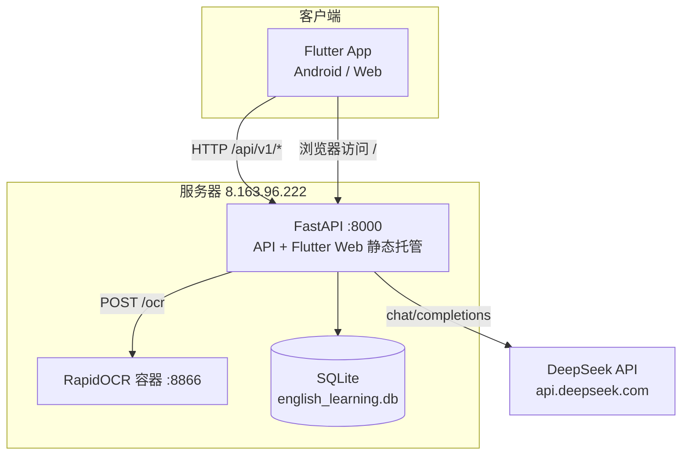
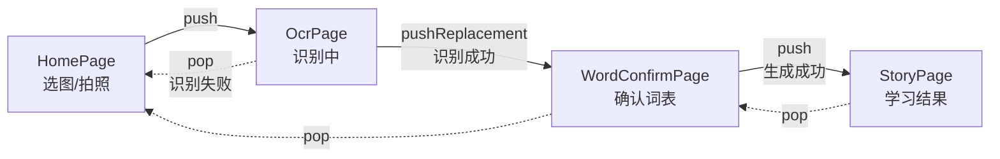

# AI English Learning App — 系统架构说明

> **对应代码状态**：第一阶段（U-1 / U-2 / U-3 / U-5 / U-7）代码改动完成后的工作区，基线提交 `cacae4b` + 未提交的前端改动。
> **整理日期**：2026-09-24
>
> 本文描述**当前代码实际是什么样**，供后续开发查阅。
> 另两份文档的定位不同：[项目架构分析报告](./项目架构分析报告.md) 是针对 `cacae4b` 的一次性评估，[问题清单与改进建议](./问题清单与改进建议.md) 是待办清单。两者均未随本阶段改动更新，时效性说明见文末第 10 节。

---

## 1. 产品定位

一款以拍照为入口的 AI 英语学习工具。一次完整使用产出一份可打印的学习材料：

```
拍照/选图 → OCR 提取单词 → 用户确认词表 → AI 生成含这些词的英文短文与中译
         → 自动生成中英文填空 → 存档 → 导出 PDF 打印
```

「用户确认词表」是第一阶段新增的环节。在此之前 OCR 结果直接进入 AI 提示词，用户无法修正识别噪声。

---

## 2. 技术栈

| 层次 | 选型 | 版本 / 说明 |
|------|------|-------------|
| 客户端 | Flutter + Dart | Flutter 3.41.7，Dart SDK `^3.11.5`，Material 3 |
| 状态管理 | `provider` (ChangeNotifier) | `^6.1.2`，单一全局 `AppProvider` |
| 网络 | `dio` | `^5.4.0`（实际解析到 5.9.2），单例封装 |
| 端能力 | `image_picker` / `path_provider` / `shared_preferences` / `cached_network_image` | 相机相册、本地路径、缓存 |
| 文档导出 | `pdf` + `printing` | 内嵌 `NotoSansSC-Regular.ttf` 解决中文字形 |
| 后端框架 | FastAPI + Uvicorn | `0.115.0` / `0.30.6`，全异步 |
| 配置 | `pydantic-settings` + `python-dotenv` | `Settings` 类集中管理 |
| HTTP 客户端 | `httpx` | 异步调用 DeepSeek 与 OCR |
| 数据库 | SQLite（标准库 `sqlite3` 直连） | 单表 `learning_records` |
| AI | DeepSeek `deepseek-chat` | OpenAI 兼容的 `/v1/chat/completions` |
| OCR | RapidOCR (ONNXRuntime) + OpenCV | 独立容器，目录名仍沿用 `paddle_ocr` |
| 容器编排 | Docker Compose | OCR 8866 / 后端 8000 |

> `requirements.txt` 中的 `sqlalchemy`、`aiosqlite`、`aiofiles` 在业务代码中零引用，持久化走标准库 `sqlite3`。

---

## 3. 部署拓扑



两个关键设计：

- **客户端不直连 OCR 服务**，图片经 FastAPI 中转。客户端只需认识一个域名一个端口。
- **FastAPI 同时托管 Flutter Web 产物**（`main.py` 末尾的兜底路由），一个进程既出 API 又出页面。

---

## 4. 代码结构

### 4.1 前端（`frontend_flutter/`）

```
lib/
├── main.dart                        67   入口：Provider 注入 + 底部双 Tab
├── config/api_config.dart           15   后端地址与超时常量
├── models/learning_record.dart      49   领域模型 + JSON 序列化
├── providers/app_provider.dart     248   状态中枢（含词表校验纯函数）
├── services/
│   ├── api_service.dart             82   Dio 单例，6 个接口封装
│   └── pdf_export_service.dart     122   A4 排版 + 中文字体嵌入
├── pages/
│   ├── home/home_page.dart         102   选图入口
│   ├── ocr/ocr_page.dart            79   识别中 / 识别失败
│   ├── words/word_confirm_page.dart 191  单词确认页（第一阶段新增）
│   ├── story/story_page.dart       109   学习结果五分区展示
│   └── history/
│       ├── history_page.dart       161   历史列表
│       └── history_detail_page.dart 102  历史详情 + PDF 导出
└── widgets/                              第一阶段新增，跨页复用
    ├── highlighted_text.dart       121   目标词高亮（英文 / 中文两种匹配）
    ├── save_button.dart             45   保存按钮三态
    └── section_card.dart            35   分节卡片

test/
├── providers/word_validation_test.dart   36   6 个测试
├── widgets/highlighted_text_test.dart   115   5 个测试
├── widgets/save_button_test.dart         55   3 个测试
└── widget_test.dart                      30   Flutter 模板遗留，运行必失败
```

### 4.2 后端（`backend_fastapi/`）

**第一阶段未改动任何后端文件。**

```
main.py                     App 装配、CORS、健康检查、静态托管
app/
├── core/config.py          Settings（pydantic-settings）
├── api/                    router.py · ocr.py · story.py · history.py
├── services/               ai_service.py · ocr_service.py
├── schemas/history.py      请求体校验
└── models/history.py       SQLite 数据访问
```

分层是标准的 **API → Service → Model**：路由只做 HTTP 语义与参数校验，Service 承载外部调用与降级，Model 封装 SQL。

---

## 5. 前端页面流转



流转设计的三个要点：

1. **OcrPage 用 `pushReplacement`**：识别成功后它没有留在栈里的价值，从确认页按返回应直接回到 Home 重新选图。
2. **确认页用 `push`**：StoryPage 按返回键天然回到确认页，**词表与勾选状态因页面仍在栈中而自动保留**，不需要回传参数。
3. **生成期间不跳转**：用户点「生成」后停留在确认页看进度，成功才 push。因此生成失败时用户本来就在确认页，页内显示错误条即可重试。

导航一律由异步流程结束这一时刻触发，`build()` 内不发起导航。

### 单词确认页的交互

| 操作 | 实现 |
|---|---|
| 勾选 / 取消 | `FilterChip.onSelected` → `toggleWord()` |
| 删除 | `FilterChip.onDeleted` → `removeWord()` |
| 手动添加 | 内联 `TextField` + 「Add」按钮 → `addWord()` |
| 生成 | 全宽 `FilledButton`，已选为空或生成中时禁用 |
| 重新生成 | 同一个按钮，`currentRecord != null` 时文案变为 Regenerate |

---

## 6. AppProvider 状态设计

单一 `ChangeNotifier`，248 行。

### 状态字段

| 字段 | 用途 |
|---|---|
| `_isLoading` | 识别与生成共用的忙碌标志 |
| `_error` | 识别 / 生成 / 加载 / 删除四条路径共用的错误 |
| `_pickedImage` | 用户选中的图片 |
| `_recognizedWords` | 词表（OCR 结果 + 手动添加），**有序** |
| `_selectedWords` | 当前勾选集合（Set） |
| `_currentRecord` | 当前学习记录 |
| `_records` | 历史列表 |
| `_isSaving` / `_isSaved` / `_saveError` | 保存状态，独立于 `_error` |

### 公开方法

| 方法 | 职责 |
|---|---|
| `setPickedImage(XFile?)` | 记录选中的图片 |
| `recognizeText()` | **只识别**，填充词表并默认全选，不再自动生成 |
| `toggleWord` / `removeWord` / `addWord` | 词表编辑；`addWord` 返回 `AddWordResult` |
| `generateFromWords(List<String>)` | 用户触发的生成入口，内部串行 `generateStory → generateFillBlank` |
| `clearError()` | 重试前清除错误 |
| `saveCurrentRecord() → Future<bool>` | 保存；保存中或已保存时直接返回 false |
| `loadRecords` / `deleteRecord` / `clearCurrentRecord` | 历史相关 |

### 两条不变量

这两条是后续改动时最容易破坏、也最该守住的：

**① `_currentRecord` 只在 `_generateStory()` 内创建。**

```
_generateStory()  ←  generateFromWords()  ←  WordConfirmPage   （唯一入口）
recognizeText()   →  不再调用 _generateStory
```

**② 保存状态的复位写在 `_generateStory()` 内部**，紧挨 `_currentRecord` 赋值处：

```dart
_isSaved = false;
_saveError = null;
_currentRecord = LearningRecord(...);
```

放在这里而不是各调用方，意味着**将来新增多少生成入口，只要最终走 `_generateStory`，复位就自动覆盖**。新增入口时只需核对这一处仍是唯一创建点。

### 词表校验

`validateNewWord(raw, existing)` 是 `app_provider.dart` 顶层的**纯函数**，返回 `AddWordResult { added, empty, noLetter, duplicate }`：

- 去首尾空格
- 拒绝空串
- 必须含至少一个字母（`123`、`---` 被拒）
- 忽略大小写去重

**仅作用于手动添加，不过滤 OCR 返回的词。** 做成顶层纯函数是为了在不依赖注入的前提下可被直接测试。

---

## 7. 后端 API

统一前缀 `/api/v1`。

| 方法 | 路径 | 说明 |
|------|------|------|
| POST | `/ocr/recognize` | multipart 上传图片 → `{"words": [...]}`；非图片 400，OCR 不可用 503 |
| POST | `/story/generate` | `{words, difficulty}` → `{english, chinese}` |
| POST | `/story/fill-blank` | `{english, chinese, words}` → `{english_blank, chinese_blank}` |
| POST | `/history/save` | 保存记录，返回自增 `id` |
| GET | `/history/records` | 分页 + 关键字检索 |
| GET | `/history/records/{id}` | 单条详情 |
| PUT | `/history/records/{id}` | 更新 `is_favorite` / `notes` |
| DELETE | `/history/records/{id}` | 删除 |
| GET | `/health` | 健康检查 |

数据表 `learning_records` 单表：`image_url, words(JSON 字符串), english_story, chinese_translation, english_blank, chinese_blank, is_favorite, notes, created_at, updated_at`。

> 前端仍**串行发起三次请求**（识别 / 生成 / 填空）。合并为单一编排接口属于 A-1，不在第一阶段范围。

---

## 8. 关键机制

### 8.1 全链路降级

OCR 连不上时 `OCRService` 回落到固定词表；DeepSeek 抛任何异常时 `AIService` 回落到固定的 fox 故事。好处是零配置即可跑通全流程；代价是**用户无法分辨真假**——这是 U-4 的范围，尚未处理。确认页同样无法区分 mock 词表。

### 8.2 OCR 双轮识别

`docker/paddle_ocr/server.py`：先对原图跑一遍，再做灰度 → 自适应阈值 → 去噪后跑第二遍，两轮结果按小写去重合并。针对手机拍摄光照不均，代价是耗时翻倍且噪声词一并增多。第一阶段新增的确认页正好承接了这部分噪声。

### 8.3 中译夹注与高亮

`generate_story` 的 prompt 要求中文译文在每个目标词的中文后附上英文原词（`苹果 (apple)`）。前端据此实现两套匹配：

- **英文侧**：按词边界大小写不敏感匹配原词
- **中文侧**：匹配 `（word）` / `(word)` 夹注，内容命中词表才高亮

命中的片段套用 `fontWeight: w700` + `colorScheme.primary`。不加下划线，因为填空区块用 `___` 表示空格，语义容易混淆。

**已知缺陷（未修）**：两侧都是精确匹配，词形变化匹配不到。OCR 给 `jump`、短文写 `jumped` 则不高亮，而后端 fill-blank 的 prompt 明确要求各种词形都要挖空——会出现「填空挖了但原文没标」的错位。

### 8.4 超时

| 位置 | 值 | 语义 |
|---|---|---|
| 前端 `receiveTimeout` | 180 s | **按单个请求计时**，三次串行请求各自独立，不累加 |
| 前端 `connectTimeout` | 30 s | |
| 后端 → DeepSeek | 120 s | |
| 后端 → OCR | 30 s | |

前端超时必须大于后端，否则前端先报错而后端仍在工作。dio 的 `receiveTimeout` 在移动端的实际执行点是 `io_adapter.dart` 中对 `request.close()` 的 `.timeout()` 包装——即「等待响应头」这一段，正好覆盖后端等 DeepSeek 的时间。Web 端公式不同（`connectTimeout + receiveTimeout` = 210 s），仍是每请求独立。

> 若将来改为 SSE 流式输出，这个语义会变：响应头会立刻返回，`receiveTimeout` 将不再覆盖「等 AI 写完」。

### 8.5 图片压缩

`pickImage(maxWidth: 1920, imageQuality: 85)`，相机与相册共用同一处调用。平台差异（已从包源码核实）：

- **Android**：传了参数必定走缩放重编码；但**带 alpha 通道的图片会存为 PNG 并跳过质量压缩**，只做尺寸缩放
- **Web**：`imageQuality` 仅对 jpg / webp 生效，gif 完全不支持这三个参数

### 8.6 PDF 导出

`pdf` + `printing`，A4 排版，`NotoSansSC-Regular.ttf` 打进 assets 解决中文字形。`printing` 直接调系统打印与分享面板。

---

## 9. 第一阶段改动摘要

| 编号 | 内容 | 主要落点 |
|---|---|---|
| U-3 | `receiveTimeout` 60 s → 180 s | `api_config.dart` |
| U-7 | 图片压缩后再上传 | `home_page.dart` |
| U-2 | 高亮真正生效；抽出公共组件，删除约 240 行重复 | `widgets/highlighted_text.dart`、`section_card.dart` |
| U-5 | 保存三态反馈 + 客户端防重复；`saveError` 与 `error` 分离 | `app_provider.dart`、`widgets/save_button.dart` |
| U-1 | 插入单词确认页；`recognizeText()` 拆分；导航反模式修正 | `pages/words/word_confirm_page.dart`、`ocr_page.dart`、`app_provider.dart` |

新增测试 3 个文件共 14 个用例，全部通过；`flutter analyze` 保持 0 告警。

---

## 10. 当前状态与后续

### 尚未验证

第一阶段是**代码完成、行为待验证**。以下需要真机与可写后端：

- U-7：压缩前后的体积与识别词表对比
- U-5：保存成功 / 保存失败 / 重新生成再保存
- U-1：正常生成、取消部分词、全部取消禁用、生成失败重试、返回后重新生成、只进确认页一次、返回后不再自动跳转

### 公开发布门槛（未处理）

以下四项是对外开放前的硬门槛，**均不在第一阶段范围，目前全部未处理**：

| 编号 | 问题 |
|---|---|
| S-1 | `main.py` 静态兜底路由存在路径穿越风险 |
| S-2 | 所有接口无鉴权 |
| S-3 | CORS 全开 + 明文 HTTP |
| A-2 | 单表无 `user_id`，数据全局共享 |

**第一阶段完成不等于可以公开发布。**

### 已知的其他待办

按[问题清单](./问题清单与改进建议.md)编号：A-1 合并编排接口与流式输出、A-3/U-4 降级可见化、A-4 SQLite 异步、A-5 拆分 Provider、U-6 分阶段进度、U-8 难度选择器与分页搜索、U-9 原图回显、U-10 中文化、U-11 Web 体积、E-1~E-5 工程化。

### 文档时效性

| 文档 | 状态 |
|---|---|
| 本文 | 对应第一阶段改动后的工作区 |
| `docs/项目架构分析报告.md` | **部分过时**：前端文件结构、`AppProvider` 接口、页面流转、超时值均已变化。其架构判断与风险评估仍成立 |
| `docs/问题清单与改进建议.md` | **部分过时**：U-1、U-2、U-3、U-5、U-7 五条已实现（U-7 效果待验证），其余条目仍有效 |
| `README.md` | **部分过时**：端口写 8000，而 `开发者操作文档.md` 用 8002；启动步骤未含 `.env` 配置 |
| `开发者操作文档.md` | **部分过时**：第七节「应用数据流」描述的是识别后直接生成，与当前确认页流程不符；端口 8002 与 `.env.example` 的 8000 不一致 |

是否更新这几份文档，由你决定；本文未改动它们。
