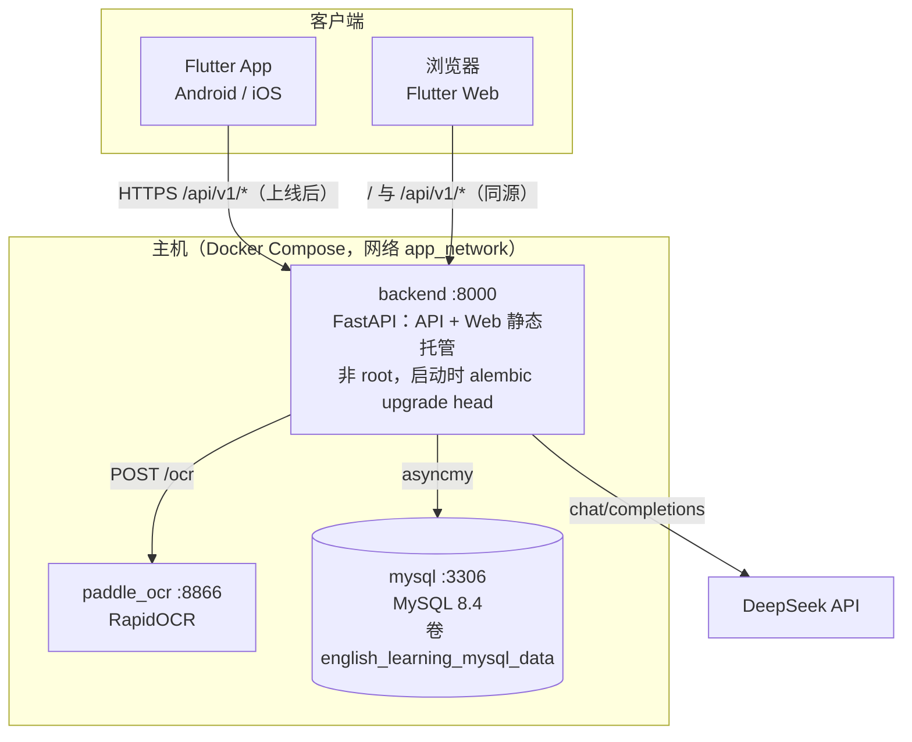
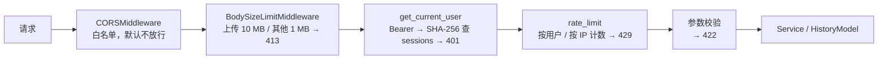
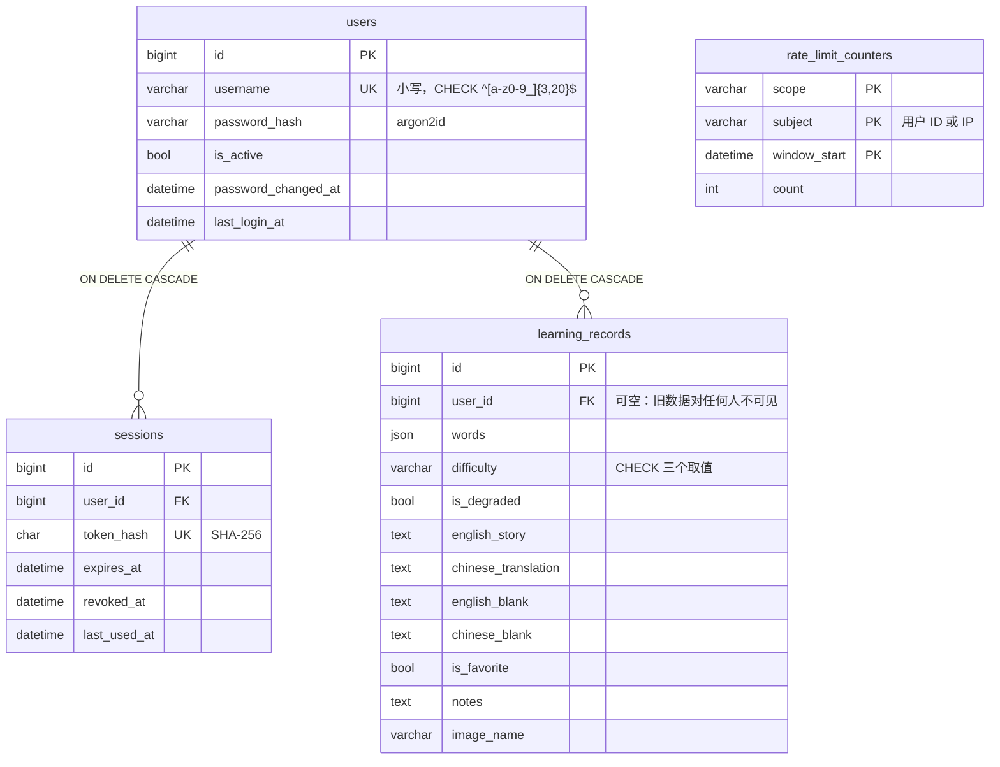
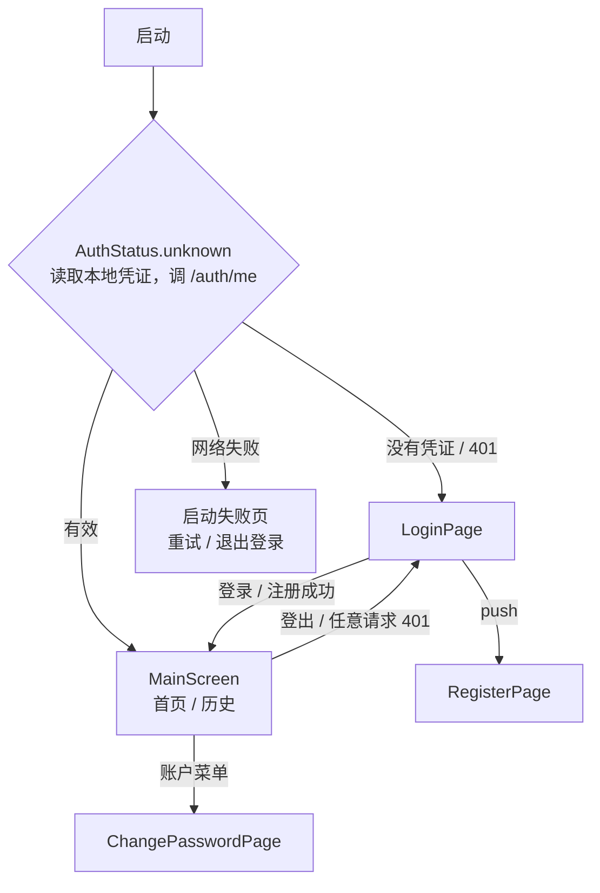
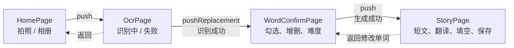

# AI 英语学习 — 系统架构说明

> **对应代码状态**：第三阶段完成（2026-10-10，最近提交 `e66038a` + E-1 构建脚本）。
> 本文描述**当前代码实际是什么样**，供后续开发查阅。操作步骤见 [开发者操作文档](./开发者操作文档.md)，接口细节见 [后端接口清单](./后端接口清单.md)。
> [项目架构分析报告](./项目架构分析报告.md) 与 [问题清单与改进建议](./问题清单与改进建议.md) 是基于 `cacae4b` 的历史快照，处理状态以各阶段收尾审查为准。

---

## 1. 产品定位

一款以拍照为入口的 AI 英语学习工具。一次完整使用产出一份可打印的学习材料：

```
登录 → 拍照 / 选图 → OCR 提取单词 → 确认词表与难度 → 一次请求生成英文短文、中译与中英文填空
     → 保存 → 历史搜索 / 详情 → 导出 PDF
```

界面为简体中文；学习内容（短文、单词、填空）为英文。每个用户只能看到自己的记录。

---

## 2. 技术栈

| 层次 | 选型 | 说明 |
|---|---|---|
| 客户端 | Flutter 3.41.7 + Dart 3.11.5，Material 3 | Android / iOS / Web |
| 状态管理 | `provider`（ChangeNotifier） | `AuthProvider`（登录状态）+ `AppProvider`（识别、生成、历史） |
| 网络 | `dio` | 单例 `ApiService`，鉴权拦截器统一附加凭证、处理 401 |
| 凭证存储 | `flutter_secure_storage`（移动端）/ `sessionStorage`（Web） | |
| 本地化 | `flutter_localizations` + `gen_l10n`，`intl` | 只有简体中文 |
| 文档导出 | `pdf` + `printing` | 内嵌 `NotoSansSC-Regular.ttf` |
| 后端框架 | FastAPI 0.115 + Uvicorn 0.30，Python 3.13 | 全异步 |
| 数据访问 | SQLAlchemy 2.0（asyncio）+ `asyncmy`；Alembic | |
| 数据库 | MySQL 8.4.11（Docker） | utf8mb4，UTC |
| 密码哈希 | `argon2-cffi`（argon2id） | |
| 配置 | `pydantic-settings` | `Settings` 集中管理，启动时校验 |
| HTTP 客户端 | `httpx` | 异步调用 DeepSeek 与 OCR |
| AI | DeepSeek `deepseek-chat` | OpenAI 兼容的 `/v1/chat/completions` |
| OCR | RapidOCR（ONNX Runtime）+ OpenCV | 独立容器，目录名沿用 `paddle_ocr` |
| 容器编排 | Docker Compose | `mysql`、`paddle_ocr`、`backend` |

---

## 3. 部署拓扑

### 3.1 容器部署（`docker compose up -d --build`）



- 主机端口映射：后端 `8000:8000`；MySQL `127.0.0.1:3307:3306`；OCR `127.0.0.1:8866:8866`。容器之间用服务名访问（`mysql:3306`、`paddle_ocr:8866`）。
- **客户端不直连 OCR**，图片经后端转发；客户端只需要知道后端一个地址。
- **后端同时托管 Flutter Web**（`backend_fastapi/static/`，由 `scripts/build_web.ps1` 生成）。Web 以空的 `API_BASE_URL` 构建，请求走相对路径，与页面同源，不需要 CORS。
- 上线时需要在前面加反向代理（HTTPS），后端端口改为只绑定本机，见第 9 节。

### 3.2 本地开发

后端在主机上用 `venv` 直跑（`uvicorn --reload --no-proxy-headers`，8000）；MySQL 和 OCR 仍在容器中，通过 `127.0.0.1:3307`、`localhost:8866` 访问。前端用 `flutter run -d chrome --web-port 5000` 调试时是跨域访问，需要 `CORS_ALLOW_ORIGINS` 放行 5000 端口。

---

## 4. 后端

### 4.1 分层

```
main.py                 App 装配：中间件、路由、/health、静态托管兜底路由、lifespan 中的每日清理任务
app/
├── api/                路由层：只做 HTTP 语义、参数校验、错误映射
│   ├── router.py       公开路由组（注册、登录）与需登录路由组（其余全部，统一挂 get_current_user）
│   ├── auth.py · ocr.py · learn.py · history.py
│   ├── errors.py       AI / OCR 失败 → 502 / 503 / 504 与中文文案
│   └── input_limits.py 词表数量与长度校验
├── auth/               dependencies（get_current_user）、passwords（规则与哈希）、tokens、service
├── ratelimit/          limiter（原子计数）、dependencies（limit_per_user / limit_per_ip）
├── services/           ai_service、ocr_service、learn_service（编排）
├── models/             ORM：User、UserSession、LearningRecord、RateLimitCounter；history.py（HistoryModel）
├── db/                 engine / session（FastAPI 依赖项）、3306 防护
├── schemas/            Pydantic 请求与响应
└── core/               config、logging、body_limit（请求体上限中间件）
```

分层仍是 **API → Service → Model**：路由层不写 SQL；Service 承载外部调用与降级；Model 封装查询。

### 4.2 请求链路



- 注册、登录没有鉴权一环，限流按 IP；其余业务接口先鉴权再按用户限流。
- 请求体上限在鉴权之前判断，超大请求不会进入数据库查询。
- 限流在参数校验之前：已超限时，即使参数有误也返回 429。

### 4.3 鉴权与会话

- 凭证是 32 字节随机数，只通过 `Authorization: Bearer` 传递；`sessions` 表只存 SHA-256。
- `get_current_user` 一次查询同时检查：凭证存在、未撤销、未过期、用户启用、会话创建时间不早于 `password_changed_at`。任一不满足即 401。
- 登出撤销当前会话；修改密码、管理员重置密码、停用账号撤销该用户全部会话。
- `last_used_at` 距上次更新超过 1 小时才写一次，避免每个请求都写库。
- 用户 ID 只来自校验后的凭证。`HistoryModel(session, user_id)` 由依赖项构造，所有查询都从 `_owned()`（`WHERE user_id = :当前用户`）开始，别人的记录与不存在的记录一律 404。

### 4.4 生成编排（`/learn/compose`）

`LearnService.compose()` 串行调用 DeepSeek 两次：

1. `generate_story(words, difficulty)`：英文短文 + 中文翻译（中文中目标词后附英文原词，供前端高亮）
2. `generate_fill_blank(english, chinese, words)`：英文填空 + 中文填空

第一步已降级时不再发第二次调用，直接用示例填空。响应中的 `degraded` / `reason` 取第一个出现的原因。

### 4.5 降级与报错

| 开关 | 失败时 |
|---|---|
| `OCR_MODE=docker`（默认，生产） | OCR 不可用 → 503 |
| `OCR_MODE=auto` | 回落示例词，`degraded=true`、`reason=ocr_unavailable` |
| `OCR_MODE=mock` | 始终返回示例词，`reason=ocr_mock` |
| `AI_FALLBACK_ENABLED=false`（默认，生产） | 未配置 503、连不上 503、超时 504、上游错误或解析失败 502 |
| `AI_FALLBACK_ENABLED=true` | 回落示例故事，`reason` 为 `ai_not_configured` / `ai_unavailable` / `ai_timeout` / `ai_upstream_error` / `ai_parse_failed` |

前端看到 `degraded=true` 时显示降级提示条；保存时带上 `is_degraded`，详情页同样标明"这是一篇示例短文"。

### 4.6 静态托管

`main.py` 末尾的兜底路由 `GET /{full_path:path}`：`realpath` 后用 `commonpath` 校验目标仍在 `static/` 内（Windows 下统一大小写），越界返回 404；文件不存在时回落 `index.html`（SPA 路由）。已知行为：GET 一个只接受 POST 的 API 路径也会回落到 `index.html`，而不是返回 405。

### 4.7 后台任务

`lifespan` 中启动一个循环任务：启动时与每 24 小时清理一次过期或已撤销超过 7 天的会话，以及超过 2 天的限流计数。由 `SESSION_CLEANUP_ENABLED` 控制，失败只记日志，不影响服务。容器中只运行 1 个 worker。

---

## 5. 数据模型



- 时间列 `DATETIME(3)`，统一存 UTC；接口输出带 `Z` 的 ISO 8601。
- 迁移：`0001` 建 `learning_records`；`0002` 建 `users`、`sessions` 并给记录加 `user_id`；`0003` 建 `rate_limit_counters`。表结构变更只通过 Alembic。
- 接口兼容层：记录在接口中仍叫 `image_url`（数据库列 `image_name`），`is_favorite` 输出 0 / 1；前端同时兼容 0 / 1 与布尔值。

---

## 6. 前端

### 6.1 代码结构

```
lib/
├── main.dart              Provider 注入（AuthProvider、AppProvider）、主题、本地化、AuthGate
├── auth/                  AuthApi（Dio 实现）、AuthInterceptor、表单校验纯函数、TokenStore（secure / web）
├── providers/
│   ├── auth_provider.dart 登录状态：恢复、登录、注册、登出、修改密码、429 倒计时
│   ├── app_provider.dart  识别、确认、生成、保存、历史
│   └── difficulty.dart · flow_phase.dart · history_paging.dart   枚举与纯函数，不是 Provider
├── pages/
│   ├── auth/              AuthGate、登录、注册、修改密码、账户操作
│   ├── main_screen.dart   底部"首页 / 历史"两个 Tab
│   ├── home/ · ocr/ · words/ · story/ · history/
├── widgets/               公共组件（Ink* 系列、WordChip、StateView、ErrorNotice、DegradedBanner、SaveButton……）
├── theme/                 ThemeData + StorybookTokens（ThemeExtension）+ context.tokens
├── l10n/                  app_zh.arb 与生成代码，context.l10n
├── services/              ApiService（Dio 单例）、api_response（错误文案映射）、pdf_export_service
├── config/api_config.dart 后端地址、超时、release 构建的 https 检查
└── dev/component_gallery.dart  调试用组件展示页（SHOW_GALLERY）
```

### 6.2 登录状态与页面流转



`AuthGate` 监听 `AuthProvider.status`，状态变化时先把导航栈退回根页面，再按状态显示登录页、主界面或启动失败页。

### 6.3 学习流程



1. **OcrPage 用 `pushReplacement`**：识别成功后不留在栈中，从确认页返回直接回到首页。
2. **确认页用 `push`**：从结果页返回时，词表和勾选状态仍在，可以改词、换难度后"重新生成"。
3. **生成期间留在确认页**：按钮显示生成中，单词编辑与难度禁用；失败时错误卡片出现在底部操作区顶部，可以重试（429 时不显示重试）。

### 6.4 AppProvider

| 状态 | 用途 |
|---|---|
| `phase`（`FlowPhase.idle / recognizing / generating`）、`error`、`errorKind` | 识别 / 生成流程与错误类别（决定是否显示"重试"、是否显示网络错误画面） |
| `pickedImage`、`recognizedWords`（有序）、`selectedWords`、`difficulty` | 确认页 |
| `currentRecord`、`isSaving` / `isSaved` / `saveError` | 当前结果与保存三态 |
| `ocrDegradedReason`、`storyDegradedReason` | 降级原因 |
| `records`、`historyTotal`、`historyQuery`、`isLoadingHistory`、`historyError`、`isLoadingMoreHistory` | 历史列表，与流程错误分开 |
| `_flowSeq`、`_historyRequestSeq` | 序号：换照片、登出或重新加载后，晚到的旧响应直接丢弃 |

| 方法 | 职责 |
|---|---|
| `startNewCapture(image)` | 选了新照片：清掉上一轮的单词、结果、保存状态与错误，保留难度 |
| `recognizeText()` | 只识别，填充词表并默认全选 |
| `toggleWord` / `selectAll` / `clearSelection` / `removeWord` / `addWord` | 词表编辑；`addWord` 先经过纯函数 `validateNewWord`（空、没有字母、超过 40 字符、重复） |
| `generateFromWords(words)` | 调 `/learn/compose`；超过 20 个单词时按钮已禁用 |
| `saveCurrentRecord()` | 保存，带上 `difficulty` 与 `is_degraded` |
| `loadRecords` / `searchRecords` / `loadMoreRecords` / `deleteRecord` | 历史 |
| `resetForSignOut()` | 登出或 401 时清空**全部**用户相关状态 |

### 6.5 错误显示

`services/api_response.dart` 的 `errorMessage()` 把异常转为中文：后端返回中文 `detail` 字符串时直接显示；`detail` 是数组（参数校验）时显示"请求参数有误。"；超时、无法连接、5xx 各有固定文案。识别、生成的 429 直接显示后端的 `detail`，不显示"重试"；登录、注册、修改密码的 429 按 `Retry-After`（`retryAfterOf()`）在提交按钮上倒计时，缺失时按 1 分钟。

---

## 7. 关键机制

### 7.1 OCR 双轮识别

`docker/paddle_ocr/server.py`：先对原图识别一遍，再做灰度 → 自适应阈值 → 去噪后识别第二遍，两轮结果按小写去重合并。针对手机拍摄光照不均；代价是耗时增加、噪声词增多，由确认页让用户剔除。后端再过滤非单词文本并去重。

### 7.2 中译夹注与高亮

`generate_story` 的提示词要求中文译文在每个目标词后附英文原词（`苹果 (apple)`）。前端 `HighlightedText` 两套匹配：英文侧按词边界、不区分大小写匹配原词；中文侧匹配 `（word）` / `(word)` 夹注，命中词表才高亮。

**已知限制**：两侧都是精确匹配，词形变化（`jump` / `jumped`）不高亮，而填空会挖掉各种词形。

### 7.3 超时

| 位置 | 值 | 说明 |
|---|---|---|
| 后端 → DeepSeek | 每次 60 s（连接 10 s） | `/learn/compose` 串行两次，最长约 120 s |
| 后端 → OCR | 30 s | |
| 前端 `receiveTimeout` | 180 s | 按单个请求计时，必须大于后端最长耗时 |
| 前端 `connectTimeout` | 30 s | |

> 若将来改为 SSE 流式输出，响应头会立即返回，`receiveTimeout` 将不再覆盖"等 AI 写完"的时间。

### 7.4 图片压缩

`pickImage(maxWidth: 1920, imageQuality: 85)`，相机与相册共用。Android 上带 alpha 通道的图片会存为 PNG、只缩放不压质量；Web 上 `imageQuality` 只对 jpg / webp 生效。

### 7.5 限流

`rate_limit_counters` 以（规则, 主体, 窗口起点）为主键，`INSERT … ON DUPLICATE KEY UPDATE count = count + 1` 原子自增，读回计数与额度比较；UTC 固定窗口，遇到死锁重试。客户端 IP 只取连接地址（uvicorn `--no-proxy-headers`）。规则与额度见 [开发者操作文档第九节](./开发者操作文档.md)。

### 7.6 PDF 导出

`pdf` + `printing`，A4 排版，标题与区块名为中文，内嵌 `NotoSansSC-Regular.ttf`（只有常规字重，粗体为模拟加粗）。`printing` 调用系统的打印与分享面板。

### 7.7 日志

`app/core/logging.py`：统一格式、UTC 时间戳、输出到标准输出，级别由 `LOG_LEVEL` 控制；uvicorn 访问日志用同一处理器，第三方库降噪。登录失败、注册冲突、触发限流记 WARNING，不含密码与凭证；数据库引擎 `hide_parameters=True`，报错不带 SQL 参数。

---

## 8. 安全边界摘要

| 项 | 实现 |
|---|---|
| 鉴权 | 只在 `get_current_user` 一处；路由清点测试防止漏加 |
| 隔离 | `HistoryModel` 绑定用户；越权 404 |
| 密码 | argon2id；登录失败结果统一；用户不存在时也做一次哈希 |
| 输入 | 请求体上限、词表上限、分页与搜索上限、文本字段上限；搜索 `LIKE` 自动转义、参数绑定 |
| 响应 | 422 不回显请求原值；错误文案不含内部信息 |
| 跨域 | `CORS_ALLOW_ORIGINS` 白名单，默认空；`allow_credentials=False` |
| 静态文件 | 真实路径校验，阻止路径穿越 |
| 明文传输 | Android 明文只在 debug；iOS 默认 ATS；移动端 release 构建要求 https 后端地址 |
| 数据库连接 | 拒绝本机 3306；测试只连 `english_learning_test` |

完整的鉴权覆盖表、限流表与攻击用例见 [第三阶段收尾审查第 4 节](./第三阶段收尾审查.md)。

---

## 9. 当前状态与已知限制

- 后端 512 个测试、前端 214 个测试全部通过；`flutter analyze` 0 问题。
- **还不能上线**：需要 HTTPS、反向代理（含客户端 IP）、后端端口只绑定本机、MySQL 账号权限拆分、每日备份、替换授权不明的插画、隐私政策等，见 [第三阶段收尾审查第 10 节](./第三阶段收尾审查.md)。
- 已知限制（未处理）：历史搜索不匹配中文译文；OFFSET 分页；OCR 返回非 JSON 时 500；iOS 缺少相机和相册权限说明；Web 首屏需下载约 10.5 MB 中文字体；词形变化不高亮。完整列表见第三阶段收尾审查第 9 节。
