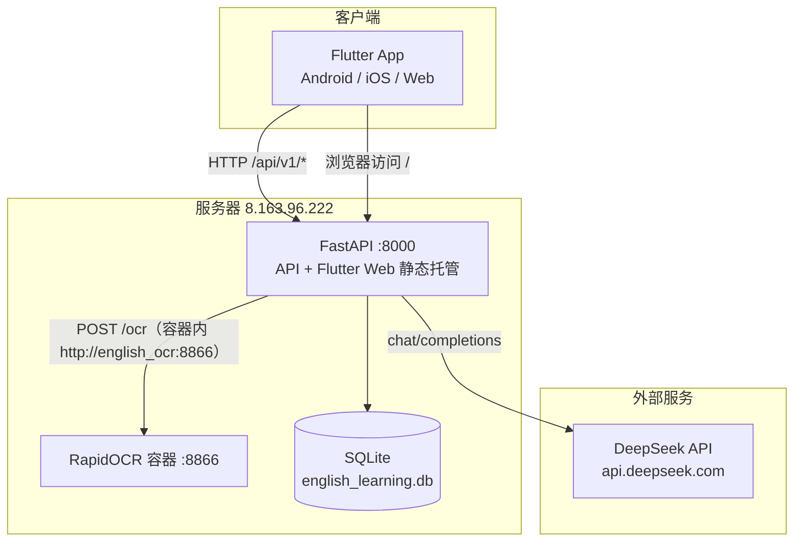
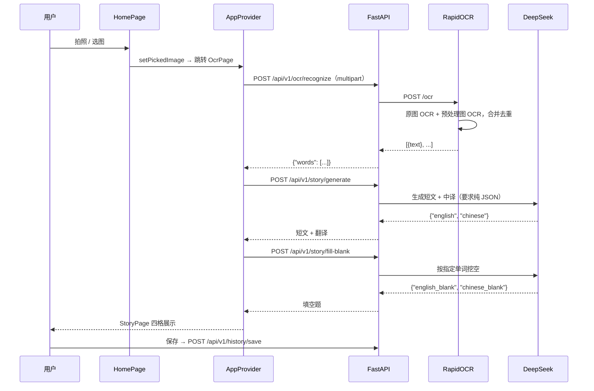

# AI English Learning App — 项目架构分析报告

> 分析日期：2026-09-24　|　分析对象：`english_learning_app`（分支 `main`，最新提交 `cacae4b`）
> 代码规模：Flutter 前端 11 个 Dart 文件 / 约 1217 行；FastAPI 后端 12 个 Python 文件；OCR 微服务 1 个文件

---

## 一、项目定位

一款**以拍照为入口的 AI 英语学习工具**：用户拍摄或上传一张包含英文单词的图片（单词表、课本、试卷），系统自动完成

**OCR 提取单词 → AI 生成包含这些单词的英文短文 + 中文翻译 → 自动生成中英文填空练习 → 存档 / 收藏 / 导出 PDF**

一条链路走完即产出一份可打印的学习材料，这是产品的核心价值点，也是整个架构的主轴。

---

## 二、技术栈总览

| 层次 | 技术选型 | 版本 / 说明 |
|------|----------|-------------|
| 客户端 | Flutter + Dart | Dart SDK `^3.11.5`，Material 3（`colorSchemeSeed: Colors.blue`） |
| 状态管理 | `provider` (ChangeNotifier) | `^6.1.2`，单一全局 `AppProvider` |
| 网络 | `dio` | `^5.4.0`，单例封装 `ApiService` |
| 端能力 | `image_picker` / `path_provider` / `shared_preferences` / `cached_network_image` | 相机与相册、本地路径、本地缓存 |
| 文档导出 | `pdf` + `printing` | `^3.11.0` / `^5.13.0`，内嵌 `NotoSansSC-Regular.ttf` 解决中文字形 |
| 后端框架 | FastAPI + Uvicorn | `0.115.0` / `0.30.6`，全异步 |
| 配置 | `pydantic-settings` + `python-dotenv` | `Settings` 类集中管理，读取 `.env` |
| HTTP 客户端 | `httpx` | `0.27.2`，异步调用 DeepSeek 与 OCR 服务 |
| 数据库 | SQLite（标准库 `sqlite3` 直连） | 单表 `learning_records`，文件位于 `backend_fastapi/data/` |
| AI 能力 | DeepSeek `deepseek-chat` | OpenAI 兼容的 `/v1/chat/completions` 协议 |
| OCR | RapidOCR (ONNXRuntime) + OpenCV | 独立容器，对外仍沿用 `paddle_ocr` 目录名 |
| 容器编排 | Docker Compose | `app_network` 桥接网络，OCR 8866 / 后端 8000 |

> **注意**：`requirements.txt` 中声明了 `sqlalchemy`、`aiosqlite`、`aiofiles`，但业务代码**完全没有引用**（已全量检索确认），实际持久化走的是标准库 `sqlite3` 同步 API。这三项属于历史遗留依赖。

---

## 三、系统架构

### 3.1 部署拓扑



一个关键设计：**前端不直接访问 OCR 服务**。提交 `c6c95c0` 把移动端的 OCR 请求改为经 FastAPI 中转，从此客户端只需认识一个域名和一个端口，既避免跨域，也省去在移动网络下暴露第二个端口。

后端还通过 `main.py` 末尾的兜底路由托管 Flutter Web 构建产物，实现"一个进程同时提供 API 与页面"，这也是 `backend_fastapi/static/` 被纳入版本库的原因。

### 3.2 分层结构

```
english_learning_app/
├── frontend_flutter/lib/
│   ├── main.dart                    # 入口：Provider 注入 + 底部双 Tab 导航
│   ├── config/api_config.dart       # 后端地址与端点常量（硬编码 IP）
│   ├── models/learning_record.dart  # 领域模型 + JSON 序列化
│   ├── providers/app_provider.dart  # 唯一状态中枢，编排三次串行请求
│   ├── services/
│   │   ├── api_service.dart         # Dio 单例，6 个接口封装
│   │   └── pdf_export_service.dart  # A4 排版 + 中文字体嵌入
│   └── pages/  home / ocr / story / history(+detail)
│
├── backend_fastapi/
│   ├── main.py                      # App 装配、CORS、健康检查、静态托管
│   └── app/
│       ├── core/config.py           # Settings（pydantic-settings）
│       ├── api/  router.py · ocr.py · story.py · history.py
│       ├── services/  ai_service.py · ocr_service.py
│       ├── schemas/history.py       # 请求体校验
│       └── models/history.py        # SQLite 数据访问层
│
├── docker/
│   ├── docker-compose.yml           # paddle_ocr + backend 两个服务
│   └── paddle_ocr/  Dockerfile · server.py
│
└── docs/ · README.md · 开发者操作文档.md
```

后端是标准的 **API → Service → Model** 三层：路由只做参数校验与 HTTP 语义，Service 承载外部调用与降级策略，Model 封装 SQL。前端是 **Page → Provider → Service → Model** 的单向数据流，页面本身几乎不持有状态。

---

## 四、核心业务流程



三处值得记下的工程细节：

1. **OCR 双轮识别**（`docker/paddle_ocr/server.py`）：先对原图跑一遍，再做灰度 → 自适应阈值 → `fastNlMeansDenoising` 去噪后跑第二遍，两轮结果按小写去重合并。这是针对手机拍摄光照不均的务实补偿，也正是提交 `bc41325` 所说"消除识别重复问题"的落点。
2. **中译夹注原词**：`generate_story` 的 prompt 明确要求中文译文里在每个目标单词的中文后附上英文原词（`苹果 (apple)`），这样第二步挖空时中英文能一一对应。
3. **三次请求串行编排全在前端 Provider**：`recognizeText → _generateStory → generateFillBlank` 链式调用，任一步失败都落到同一个 `_error` 上。

---

## 五、API 清单

统一前缀 `/api/v1`。

| 方法 | 路径 | 说明 |
|------|------|------|
| POST | `/ocr/recognize` | multipart 上传图片，返回 `{"words": [...]}`；非图片 MIME 返回 400，OCR 不可用返回 503 |
| POST | `/story/generate` | `{words, difficulty}` → `{english, chinese}`，难度分 beginner/intermediate/advanced |
| POST | `/story/fill-blank` | `{english, chinese, words}` → `{english_blank, chinese_blank}` |
| POST | `/history/save` | 保存一条完整学习记录，返回自增 `id` |
| GET | `/history/records` | 分页 + 关键字检索（`page`/`page_size`/`search`） |
| GET | `/history/records/{id}` | 单条详情 |
| PUT | `/history/records/{id}` | 局部更新 `is_favorite` / `notes` |
| DELETE | `/history/records/{id}` | 删除 |
| GET | `/health` | 健康检查 |

数据表 `learning_records` 单表存储：`image_url, words(JSON 字符串), english_story, chinese_translation, english_blank, chinese_blank, is_favorite, notes, created_at, updated_at`。

---

## 六、架构亮点

**1. 全链路降级设计。** 这是本项目最有辨识度的一点。OCR 连不上时 `OCRService` 回落到 mock 词表；DeepSeek 调用抛任何异常时 `AIService` 回落到 mock 故事（提交 `9326e94` 专门为此而做）。结果是：没有 API Key、没装 Docker 的新人克隆下来就能跑通完整流程。

**2. 单进程一体化部署。** FastAPI 同时承担 API 与 Flutter Web 静态托管，`docker compose` 起两个容器即完成部署，对个人项目而言运维成本极低。

**3. 前端防御性解析。** `AppProvider._safeString` / `_extractWords` 对后端返回的 `Map`/`String`/`List` 做兜底转换，专治大模型返回结构漂移导致的 `_Map is not a subtype of String` 崩溃。

**4. OCR 选型务实。** 用 RapidOCR(ONNX) 替换 PaddlePaddle，镜像体积和冷启动时间大幅下降（Dockerfile 注释明写"不再需要 paddlepaddle"），并配置了腾讯云 apt 源与清华 pypi 源，构建速度对国内网络友好。

---

## 七、风险与改进建议

按优先级排列。

### 高优先级

| # | 问题 | 位置 | 说明与建议 |
|---|------|------|-----------|
| 1 | **静态文件路由存在路径穿越风险** | `backend_fastapi/main.py:39` | `os.path.join(static_dir, full_path)` 未对 `full_path` 做归一化校验，编码后的 `..` 序列有可能读到 `static/` 之外的文件（包括 `.env`）。建议改用 `StaticFiles` 挂载，或先 `os.path.realpath` 后校验前缀。 |
| 2 | **所有接口无鉴权** | 全部 `app/api/*` | 历史记录是全局共享的单用户模型，公网 IP 上任何人都可读取、修改、删除他人记录。若继续公网部署，至少需要一层 API Key 或设备标识隔离。 |
| 3 | **CORS 全开 + 明文 HTTP** | `main.py:16`、`AndroidManifest.xml` | `allow_origins=["*"]` 且 `usesCleartextTraffic="true"`，`frontend_url` 配置项形同虚设。建议收敛来源白名单并接 HTTPS。 |
| 4 | **静默降级会产出"假数据"** | `ocr_service.py:24`、`ai_service.py:38` | `auto` 模式下 OCR 失败会返回 `apple/book/cat...` 固定词表，AI 失败会返回固定的 fox 故事——用户完全无法分辨这是真实识别还是兜底数据。建议在响应中加 `"degraded": true` 标记，前端给出明确提示。 |

### 中优先级

| # | 问题 | 位置 | 说明与建议 |
|---|------|------|-----------|
| 5 | **后端 Dockerfile 缺失** | `docker/docker-compose.yml:22` | compose 中 `backend` 服务指向 `../backend_fastapi/Dockerfile`，该文件不存在，`docker compose up` 会直接构建失败。README 的 Docker 启动步骤目前只对 OCR 服务成立。 |
| 6 | **后端地址硬编码** | `lib/config/api_config.dart:2` | `http://8.163.96.222:8000` 写死在源码里，切换环境必须改代码重新打包。建议改为 `--dart-define` 注入。 |
| 7 | **同步 SQLite 调用阻塞事件循环** | `app/models/history.py` | 方法声明为 `async` 但内部是阻塞的 `sqlite3` 调用，并发上来后会拖住整个 Uvicorn worker。建议 `run_in_threadpool` 包装，或启用已在依赖中的 `aiosqlite`。 |
| 8 | **AI 返回解析不健壮** | `ai_service.py:79` | 直接 `json.loads(content)`，模型若输出 ` ```json ` 代码块包裹就会抛 `JSONDecodeError`——且这一步在降级逻辑之外，会直接 500。建议剥离围栏或用正则提取首个 JSON 对象。 |
| 9 | **测试基本为空** | `backend_fastapi/tests/`（空目录）、`frontend_flutter/test/widget_test.dart` | 后端零测试；前端只有 Flutter 模板自带的 counter 测试，断言 `find.text('0')`，与当前 UI 完全不符，一跑就红。 |

### 低优先级

| # | 问题 | 说明 |
|---|------|------|
| 10 | 构建产物入库 | `backend_fastapi/static/` 下 36 个文件已被 Git 跟踪，`main.dart.js` 等产物每次重新构建都会造成巨大 diff；另有未跟踪的 `static/assets/assets/` 嵌套目录残留，建议清理并改为 CI 构建。 |
| 11 | 冗余依赖 | `sqlalchemy` / `aiosqlite` / `aiofiles` 未被引用，建议移除或按第 7 条真正用起来。 |
| 12 | 分页仅后端实现 | `getRecords` 前端固定传 `page=1, pageSize=20`，UI 无翻页与搜索入口，记录超过 20 条后不可见。 |
| 13 | `image_url` 名不副实 | 实际只存了本地文件名（`_pickedImage.name`），图片本身从未上传或持久化，历史详情页无法回显原图。 |
| 14 | 目录命名误导 | `docker/paddle_ocr/` 内实际运行的是 RapidOCR，建议更名以免后续维护者误判。 |
| 15 | `docs/` 为空目录 | 主要文档 `开发者操作文档.md`（约 570 行，内容详实）放在根目录，建议归拢。 |

---

## 八、总体评价

这是一个**边界清晰、链路完整、工程取舍明确**的个人全栈项目。分层规范、职责单一，后端三层结构和前端单向数据流都写得干净；OCR 双轮识别、中译夹注原词、全链路降级这几处设计，都能看出是被真实使用场景（手机拍照、网络不稳、大模型输出不可控）反复打磨过的结果，而非照搬模板。

当前的主要差距集中在**从"能用"走向"可公网运营"**这一段：鉴权缺位、静态路由未加固、CORS 全开是必须先补的三块；其次是降级策略的可见性——为了保证 demo 顺畅而设计的静默 mock，在生产环境会变成"用户拿到假结果却不知情"的严重体验问题。测试覆盖为零则意味着后续任何重构都缺乏安全网。

若要排一个改进顺序，建议：**加固静态路由与鉴权 → 给降级路径加显式标记 → 补齐后端 Dockerfile 打通完整容器化 → 为三个 Service 补集成测试 → 再谈多用户与图片持久化**。
